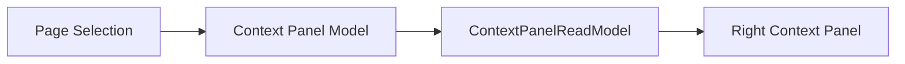

# FoxPilot 第二阶段右侧上下文面板模型

## 1. 文档目的

这份文档只定义一件事：

> 第二阶段桌面端右侧上下文面板应该承载什么、什么时候切换、哪些信息必须稳定存在。

如果没有这层模型，后面很容易出现：

- 右侧面板只是重复主列表字段
- 每个页面各做一套详情区
- 任务、运行、平台、技能、MCP 的解释方式不一致

## 2. 定位

右侧上下文面板不是：

- 主详情页替代品
- 任意堆字段的侧栏
- 全局写操作面板

它是：

> 当前选中对象的解释层、关系层和下一步动作入口。

## 3. 总链



## 4. 第一原则

右侧面板必须始终回答：

```text
当前选中了什么
为什么值得关注
它和哪些对象有关
下一步最可能做什么
```

## 5. 正式对象类型

建议第二阶段统一为：

```ts
type ContextPanelModel =
  | TaskContextPanel
  | RunContextPanel
  | EventContextPanel
  | ProjectContextPanel
  | RepositoryContextPanel
  | PlatformContextPanel
  | SkillContextPanel
  | MCPContextPanel
  | HealthIssueContextPanel
  | WizardStepContextPanel
  | FocusItemContextPanel
  | EmptyContextPanel
```

## 6. 通用字段骨架

建议所有右侧面板对象都先收敛到：

```ts
interface BaseContextPanel {
  kind: string
  title: string
  subtitle?: string
  status?: string
  summary: string
  metrics?: Array<{ label: string; value: string }>
  relations?: Array<{ label: string; targetKind: string; targetId: string }>
  recommendedActions?: ContextAction[]
  warnings?: string[]
}
```

## 7. 各页面的右侧职责

### 7.1 Dashboard

右侧面板应承接：

- 当前 Focus Queue 项说明
- 关联项目 / 任务 / 运行
- 推荐跳转

### 7.2 Tasks

右侧面板应承接：

- 任务摘要
- 当前阶段 / 角色 / 平台
- 最近运行
- handoff 摘要
- 可做动作

### 7.3 Runs

右侧面板应承接：

- run 摘要
- execution session 状态
- handoff 产物摘要
- 错误与阻塞原因
- cancel / retry 类动作入口

### 7.4 Events

右侧面板应承接：

- 事件来源
- 事件影响对象
- 后续动作
- 结果摘要

### 7.5 Control Plane

右侧面板应承接：

- platform / skill / mcp 当前状态
- 被谁依赖
- 最近 doctor 结果
- inspect / doctor / repair 建议

### 7.6 Health

右侧面板应承接：

- 问题摘要
- 影响范围
- 推荐修复路径
- 是否需要重新进入 init wizard

## 8. 右侧面板不该承载什么

第二阶段右侧面板不应承载：

- 复杂批量操作
- 全局配置编辑器
- 全页日志浏览器
- 多步骤安装向导主体

这些应该留给：

- 中央主区
- Control Plane 子页
- Wizard 主流程

## 9. 动作边界

右侧面板允许：

```text
inspect
doctor
轻量跳转
轻量确认
少量单对象动作
```

右侧面板不允许：

```text
跨对象批量 destructive 操作
系统级全局配置改写
复杂多步骤修复流程
```

## 10. 空态 / 加载态 / 错误态

右侧面板必须稳定支持：

- 空选中态
- 载入中
- 数据缺失
- 权限 / 依赖缺失
- 对象已失效

不要让右侧面板直接塌成空白。

## 11. 与详情页的关系

右侧面板不是为了替代详情页。

正确关系应是：

```text
详情页负责完整解释对象
右侧面板负责快速解释当前焦点
```

所以：

- Tasks 页右侧面板不等于 Task Detail 页
- Runs 页右侧面板不等于 Run Detail 页

## 12. 第一批范围控制

第二阶段第一批先固定：

```text
稳定对象类型
稳定字段骨架
稳定推荐动作
稳定异常态
```

先不做：

- 用户自定义右侧卡片
- 拖拽布局
- 多面板并排

## 13. 审核点

你审核这份模型时，重点看：

```text
1  是否接受右侧面板作为解释层、关系层、下一步动作入口
2  是否接受 Task / Run / Event / Platform / Skill / MCP / Health / Wizard / Focus Item 这些正式对象类型
3  是否接受右侧面板只放轻量单对象动作，不承载复杂批量写操作
4  是否接受右侧面板和完整详情页分层，而不是互相替代
```
