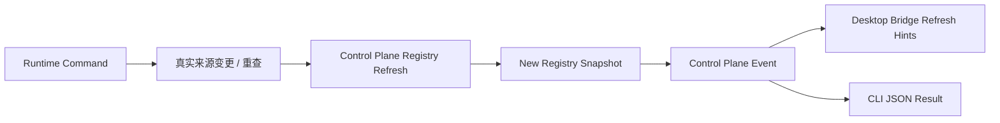

# FoxPilot 第二阶段中控注册表更新与事件模型

## 1. 文档目的

这份文档只定义一件事：

> `Platforms / Skills / MCP` 注册表在第二阶段如何更新，以及这些更新如何通过事件传播到页面和运行时。

## 2. 模型定位

第二阶段中控注册表已经确定只是：

> 聚合读模型，不是真相源。

所以这份事件模型要解决的是：

- 哪些动作会触发重新聚合
- 聚合结果怎么落成新的注册表快照
- 页面应该收到什么刷新信号

## 3. 更新总链



## 4. 会触发注册表更新的动作

### 4.1 Platforms

```text
platform.detect
platform.doctor
platform.resolve
```

### 4.2 Skills

```text
skill.install
skill.uninstall
skill.enable
skill.disable
skill.doctor
skill.repair
```

### 4.3 MCP

```text
mcp.add
mcp.remove
mcp.enable
mcp.disable
mcp.doctor
mcp.repair
mcp.restart
```

## 5. 事件分类

建议第二阶段中控事件至少分成 3 类：

```text
registry_refreshed
entity_status_changed
entity_operation_completed
```

## 6. 事件结构

```ts
interface ControlPlaneEvent {
  eventId: string
  type: 'registry_refreshed' | 'entity_status_changed' | 'entity_operation_completed'
  target: 'platform' | 'skill' | 'mcp' | 'control-plane'
  targetId: string | null
  causedBy: string
  timestamp: string
  summary: string
  refreshHints: string[]
  payload: Record<string, unknown>
}
```

## 7. 注册表刷新策略

### 7.1 全量刷新

适用于：

```text
platform.detect
platform.doctor
skill.doctor
mcp.doctor
```

### 7.2 局部刷新

适用于：

```text
skill.enable
skill.disable
skill.repair
mcp.restart
mcp.enable
mcp.disable
```

### 7.3 派生刷新

适用于：

```text
platform.resolve
init.preview
init.apply
```

这类动作不一定直接改平台注册表，但会影响：

```text
projectInit
tasks
runs
controlPlane
```

## 8. 与 Desktop Bridge 的关系

`Desktop Bridge` 不需要理解所有事件细节，但必须理解：

```text
refreshHints
```

所以 Control Plane 事件模型最终至少要给 Bridge 这些值：

```text
controlPlane
health
projectInit
tasks
runs
events
```

## 9. 与 Event Service 的关系

正确关系是：

```text
Control Plane Event
属于 Event Service 管理的事件子集
```

## 10. 审核点

你审核这份模型时，重点看：

```text
1  是否接受 Control Plane Event 作为 Event Service 的事件子集
2  是否接受注册表更新分成 全量刷新 / 局部刷新 / 派生刷新
3  是否接受 refreshHints 作为页面刷新唯一正式提示
4  是否接受 detect / doctor / repair / restart 都会触发注册表更新事件
```
