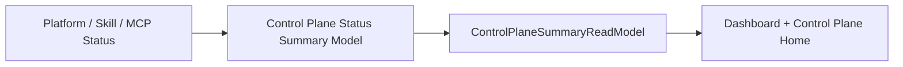

# FoxPilot 第二阶段 Control Plane 状态汇总模型

## 1. 文档目的

这份文档只定义一件事：

> 第二阶段 `Control Plane` 首页和 Dashboard 中控摘要块，到底如何把 Platforms / Skills / MCP 的状态统一汇总出来。

如果没有这层模型，后面很容易出现：

- 三类对象各自算状态
- Dashboard 和 Control Plane 首页口径不一致
- ready / degraded / unavailable 数量无法稳定比较

## 2. 定位

这份模型不是：

- 单对象详情模型
- 动作协议
- doctor 输出原文

它是：

> 中控层状态总览的统一口径。

## 3. 第一原则

第二阶段中控状态汇总必须固定：

```text
单对象状态先标准化
再做分类汇总
最后做首页摘要
```

## 4. 第一批标准状态

建议第二阶段先统一为：

```text
ready
degraded
unavailable
unknown
```

## 5. 适用对象

这套状态模型第一批适用于：

```text
platform
skill
mcp
```

## 6. 总链



## 7. 汇总结果结构

建议第二阶段统一为：

```ts
interface ControlPlaneStatusSummary {
  overall: SummaryBucket
  platforms: SummaryBucket
  skills: SummaryBucket
  mcps: SummaryBucket
}

interface SummaryBucket {
  ready: number
  degraded: number
  unavailable: number
  unknown: number
  topIssues: string[]
}
```

## 8. 状态标准化规则

### 8.1 ready

表示：

- 可检测
- 可用
- 无明显阻塞

### 8.2 degraded

表示：

- 仍可部分工作
- 存在告警或依赖缺失
- 建议尽快 doctor / repair

### 8.3 unavailable

表示：

- 当前不可用
- 关键依赖缺失
- 无法承担正常动作

### 8.4 unknown

表示：

- 尚未检测
- 数据未刷新
- 当前状态不可信

## 9. Dashboard 如何用

Dashboard 只消费：

- 总量
- 当前异常数量
- topIssues

不要把 Control Plane 全量细节都塞回首页。

## 10. Control Plane 首页如何用

Control Plane 首页应在 Dashboard 摘要基础上继续展开：

- 平台分布
- skills 分布
- mcp 分布
- 最近 doctor / detect 结果
- 异常跳转

## 11. topIssues 第一批来源

建议第二阶段先从这些来源抽：

- unavailable 平台
- degraded skill
- degraded mcp
- 缺少 binding 的关键对象
- 需要 repair 的对象

## 12. 与批量动作策略的关系

这份模型回答：

```text
当前中控整体怎么样
```

批量动作策略回答：

```text
哪些动作允许在首页放批量入口
```

两者不能混。

## 13. 第一批范围控制

第二阶段第一批先不做：

- 用户自定义状态类别
- 趋势图
- 历史状态对比
- 复杂健康评分

先固定：

```text
统一状态词表
统一分类汇总
统一 topIssues 口径
```

## 14. 审核点

你审核这份模型时，重点看：

```text
1  是否接受 ready / degraded / unavailable / unknown 四类标准状态
2  是否接受 Dashboard 和 Control Plane 首页共用同一套状态汇总口径
3  是否接受 topIssues 作为首页摘要核心字段
4  是否接受第二阶段先做状态总览，不做复杂趋势和评分图
```
