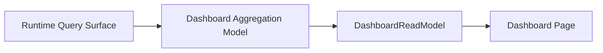

# FoxPilot 第二阶段 Dashboard 聚合模型

## 1. 文档目的

这份文档只定义一件事：

> 第二阶段 Dashboard 首页到底应该聚合哪些信息、来自哪里、为什么能作为中控首页。

如果没有这层模型，后面会出现：

- Dashboard 只是几张孤立统计卡
- 任务、运行、健康、中控各自一块，彼此没有主次
- 用户进入桌面端后，看不到“现在最该处理什么”

## 2. 模型定位

Dashboard 不是：

- 任务列表的缩略版
- Control Plane 的摘要页
- Settings 的健康页

它是：

> FoxPilot 作为本地 AI 协作中控的首页聚合视图。

## 3. 总链



## 4. Dashboard 必须回答的问题

首页至少要回答：

```text
现在有哪些项目正在活跃
当前最重要的任务有哪些
最近有哪些运行刚结束或失败
平台 / skill / mcp 当前是否健康
现在最值得用户立刻处理什么
```

## 5. 正式聚合结构

建议第二阶段统一为：

```ts
interface DashboardAggregation {
  portfolio: PortfolioSummary
  tasks: TaskSummaryBlock
  runs: RunSummaryBlock
  health: HealthSummaryBlock
  controlPlane: ControlPlaneSummaryBlock
  focusQueue: DashboardFocusItem[]
}
```

## 6. 第一批聚合块

### 6.1 Portfolio Summary

回答：

```text
当前有多少项目、多少仓库、多少已接管项目
```

### 6.2 Task Summary

回答：

```text
活跃任务数
阻塞任务数
待确认任务数
最近更新任务
```

### 6.3 Run Summary

回答：

```text
最近运行
失败运行
等待结果回收的运行
```

### 6.4 Health Summary

回答：

```text
当前 foundation / project config / bindings 是否有明显问题
```

### 6.5 Control Plane Summary

回答：

```text
platform / skill / mcp 的 ready / degraded / unavailable 分布
```

### 6.6 Focus Queue

回答：

```text
现在最值得点开的 3 到 7 个对象是什么
```

## 7. Focus Queue 为什么重要

如果 Dashboard 只有统计卡，用户还要自己判断：

- 先去看任务
- 还是先去看某个失败运行
- 还是先去修 MCP

所以第二阶段首页必须直接给：

```text
Focus Queue
```

也就是当前最值得处理的事项。

## 8. Focus Queue 第一批规则

建议优先级按：

```text
1  阻塞中的 foundation / config 问题
2  已失败或 blocked 的 run
3  required binding 缺失
4  degraded 的平台 / mcp / skill
5  最近待推进的高优任务
```

## 9. Dashboard 与其他页面的关系

Dashboard 不应该承载全部操作，只负责：

```text
汇总
排序
指向
轻量触发
```

正式深入操作仍然跳去：

- Tasks
- Runs
- Control Plane
- Settings / Health

## 10. 第一批可触发动作

建议 Dashboard 第一批只开放：

```text
查看任务
查看运行
打开平台 / skill / mcp 详情
重新运行 doctor
回到 init wizard
```

不建议首页一开始就做复杂写动作。

## 11. 刷新规则

Dashboard 应主要消费：

```text
dashboard
tasks
runs
health
controlPlane
```

其中：

- `tasks` 变化刷新任务块
- `runs` 变化刷新运行块
- `health / controlPlane` 变化刷新健康和中控块

## 12. 第一批范围控制

第二阶段第一批先不做：

- 可自定义首页布局
- 用户自定义卡片
- 时间段趋势图
- 复杂统计分析

先固定：

```text
稳定聚合块
稳定 Focus Queue
稳定跳转链
```

## 13. 审核点

你审核这份模型时，重点看：

```text
1  是否接受 Dashboard 作为首页聚合层，而不是表格缩略图
2  是否接受 Portfolio / Tasks / Runs / Health / ControlPlane / FocusQueue 六块结构
3  是否接受 Focus Queue 成为首页核心差异化区域
4  是否接受第一批 Dashboard 以聚合和跳转为主，不承担复杂写操作
```
