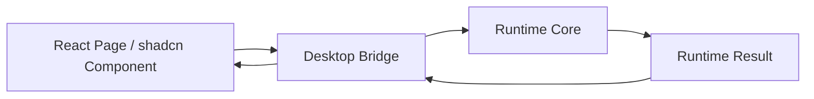

# FoxPilot 第二阶段 Desktop Bridge 契约

## 1. 文档目的

这份文档只定义一件事：

> Tauri 桌面端如何通过 `Desktop Bridge` 调用 `Runtime Core`，而不把页面直接绑死到 CLI 或 SQLite。

第二阶段已经确定：

- Desktop 与 CLI 分开
- `Runtime Core` 是唯一业务核心
- `CLI --json` 只是脚本化和调试接口

所以桌面端正式通道必须是：

```text
Desktop
-> Desktop Bridge
-> Runtime Core
```

## 2. Bridge 定位

`Desktop Bridge` 是桌面端唯一正式业务入口。

它负责：

- 接收前端动作
- 组装 Runtime 请求
- 调 Runtime Core
- 返回结构化结果给 React 页面
- 做桌面端错误映射

它不负责：

- 自己做业务规则
- 自己决定阶段 / 角色 / 平台
- 直接读写 SQLite
- 直接调用 Beads / Skills / MCP / 平台命令

## 3. 总体调用链



## 4. Bridge 基础接口

建议统一为三类方法：

```ts
interface DesktopBridge {
  invoke(command: RuntimeCommand): Promise<RuntimeResult>
  query(command: RuntimeCommand): Promise<RuntimeResult>
  mutate(command: RuntimeCommand): Promise<RuntimeResult>
}
```

这里 `query / mutate` 只是语义分组，底层仍然统一走 Runtime 命令模型。

## 5. 前端传入结构

前端不应该自己拼一大串 shell 参数，而是组装结构化请求：

```ts
interface DesktopBridgeRequest<TPayload = Record<string, unknown>> {
  name: string
  payload: TPayload
  context: {
    locale: string
    projectId: string | null
    cwd: string | null
  }
}
```

Bridge 再把它转成正式 `RuntimeCommand`。

## 6. 前端收到的返回

Bridge 返回给 React 的结果应该尽量接近 Runtime，但可以补少量桌面态字段：

```ts
interface DesktopBridgeResponse<TData = Record<string, unknown>> {
  ok: boolean
  command: string
  data?: TData
  error?: RuntimeError
  meta: {
    requestId: string
    timestamp: string
    changed: boolean
    refreshHints?: string[]
  }
}
```

`refreshHints` 这一类桌面态提示可以存在，但不能改 Runtime 真相字段。

## 7. 为什么桌面端不能直接走 CLI

第二阶段里，桌面端可以临时复用 CLI 做调试，但不能把 CLI 当正式主桥。

原因很简单：

```text
CLI 是命令行入口
Desktop 是桌面交互入口
两者共享核心，不应互相嵌套
```

如果桌面端正式依赖 CLI，会出现：

- 还要解析文本或 JSON
- 错误模型多一层
- CLI 参数变动会拖坏桌面端

所以正确关系是：

```text
Desktop Bridge -> Runtime Core
CLI Adapter    -> Runtime Core
```

而不是：

```text
Desktop -> CLI -> Runtime
```

## 8. Bridge 允许的命令范围

Bridge 第一批允许发起的命令建议限制为：

```text
init.scan
init.preview
init.apply

task.list
task.show
task.history
run.show
event.list
health.summary

controlPlane.overview
platform.list
platform.inspect
platform.detect
platform.doctor
platform.capabilities
platform.resolve

skill.list
skill.inspect
skill.doctor
skill.repair

mcp.list
mcp.inspect
mcp.doctor
mcp.repair
mcp.restart
```

这样先把：

- 读主链
- 健康主链
- 中控主链

跑通，再逐步补安装、卸载、增删类高风险动作。

## 9. 错误映射规则

Bridge 层只负责把 Runtime 错误翻译成桌面端可展示错误，不负责改错。

建议统一映射：

```text
PROJECT_NOT_FOUND           -> 页面空状态 / 重新选择项目
PLATFORM_NOT_FOUND          -> 右侧面板错误提示
SKILL_REPAIR_FAILED         -> 操作失败通知
MCP_RESTART_FAILED          -> 带重试按钮的告警
FOUNDATION_NOT_READY        -> 导向 Foundation / Health 页面
```

## 10. 刷新提示规则

Bridge 在变更命令成功后，建议给前端最小刷新提示：

```text
controlPlane
tasks
runs
health
projectInit
```

例如：

```text
skill.repair
-> refreshHints = ["controlPlane", "health"]

platform.detect
-> refreshHints = ["controlPlane", "projectInit"]
```

这样前端不用自己猜哪块该刷新。

## 11. 安全边界

Bridge 必须禁止：

```text
任意 shell 命令透传
任意文件系统读写透传
页面直接传 Runtime 不认识的命令
页面自己发明业务动作名
```

Bridge 只接受白名单命令，并把它们转成标准 Runtime 命令。

## 12. 审核点

你审核这份契约时，重点看：

```text
1  是否接受 Desktop Bridge 作为桌面端唯一正式业务入口
2  是否接受 Desktop 不再正式依赖 CLI 作为主通道
3  是否接受 Bridge 第一批只开放读、doctor、repair 主链
4  是否接受 refreshHints 作为桌面侧最小刷新协议
```
