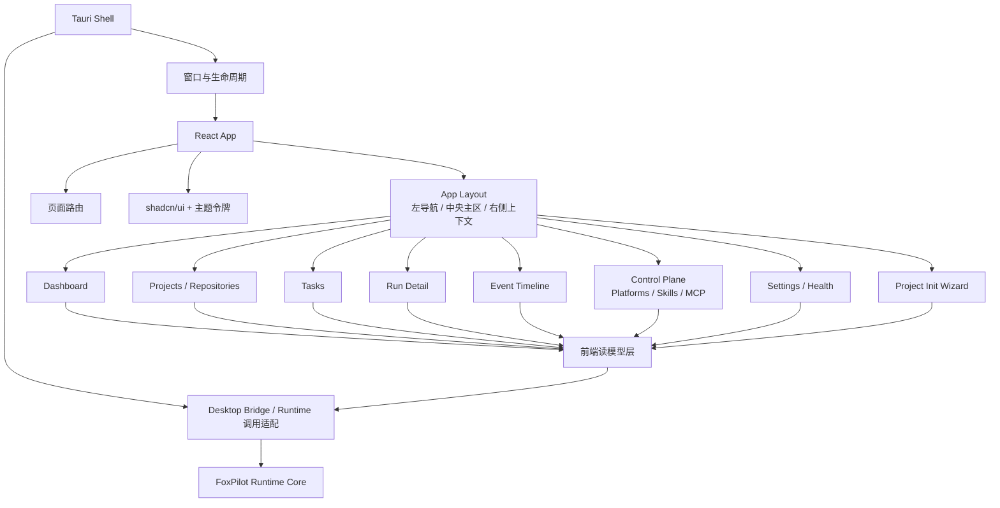

# FoxPilot 第二阶段桌面端模块图

## 1. 文档目的

这份文档只解决一个问题：

> 第二阶段桌面端内部模块怎么分层。

它承接主规格和工具架构图，但只关注桌面端本身，不展开 Foundation、Beads 和任务模型细节。

## 2. 模块总图



## 3. 模块职责

### 3.1 Tauri Shell

负责：

- 提供桌面窗口
- 管理菜单、窗口、生命周期
- 向 React 层暴露最小桥接能力

不负责：

- 业务规则判断
- 任务状态流转
- 直接读写 SQLite

### 3.2 React App

负责：

- 页面组织
- 交互流程
- 状态展示
- 列表、详情、筛选、引导

不负责：

- 把 CLI 文本输出硬解析成复杂业务模型
- 自己复制一套业务规则

### 3.3 Desktop Bridge 层

这是桌面端的关键中间层。

负责：

- 组装 Runtime 请求
- 接收成功结果和错误结果
- 把返回值转成前端可消费对象

建议单独维护：

- `src/desktop/bridge/runtime-bridge.ts`
- `src/desktop/bridge/bridge-contract.ts`

### 3.4 前端读模型层

负责：

- 组织表格和详情页需要的数据
- 维护当前筛选条件
- 维护当前选中项
- 组织右侧上下文面板需要的聚合信息

它是“展示态”，不是“业务真相”。

业务真相仍然来自 Runtime Core 和本地数据层。

建议优先固定两份配套契约：

- `Desktop Bridge` 契约
- 桌面读模型契约

进一步建议补三份运行时承接文档：

- `Runtime 查询面`
- `页面级数据契约`
- `读模型刷新策略`

## 4. 一级页面与主职责

```text
Dashboard             总览系统状态
Projects / Repos      看项目与仓库结构
Tasks                 看任务列表与任务筛选
Run Detail            看单次运行上下文
Event Timeline        看事件 -> 动作 -> 结果链路
Control Plane         看平台、Skills、MCP 的统一管理视图
Settings / Health     看安装方式、环境、doctor 结果
Project Init Wizard   做项目级初始化接管
```

## 5. 推荐组件分组

### 5.1 通用组件

- 状态标签
- 来源标签
- 阶段 / 角色 / 平台 标签
- 告警提示
- 空状态
- 命令结果提示条

### 5.2 数据展示组件

- 指标卡片
- 数据表格
- 详情面板
- 时间线
- 日志摘要块
- 健康检查结果卡片

### 5.3 向导组件

- 步骤条
- Profile 选择卡
- 平台解析卡
- Summary 区块
- 完成态引导卡

## 6. 第二阶段第一批实现顺序

桌面端不建议一上来做全量页面。

第一批建议：

```text
1  App Layout
2  Dashboard
3  Tasks
4  Run Detail
5  Project Init Wizard
6  Control Plane
7  Settings / Health
```

原因：

- 这几页最能体现桌面控制台价值
- 也最适合先走 Runtime 读模型承接

## 7. 当前结论

桌面端模块结构已经明确为：

- `Tauri` 做桌面壳
- `React + Vite + shadcn/ui` 做界面层
- `Desktop Bridge` 做 Runtime 适配
- 读模型层做界面聚合
- 页面层承接第一阶段已完成的 CLI 能力
