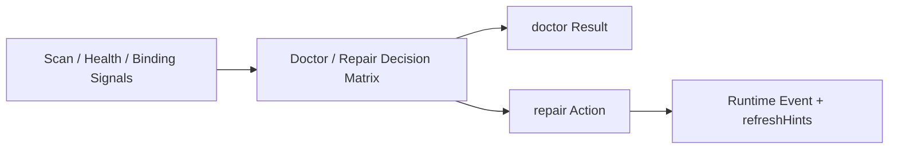

# FoxPilot 第二阶段 Doctor / Repair 决策矩阵

## 1. 文档目的

这份文档只定义一件事：

> 第二阶段 `doctor` 与 `repair` 到底应该怎么判断、分级和给出动作建议。

如果没有这张矩阵，后面会出现：

- doctor 只告诉你“有问题”
- repair 什么时候自动、什么时候确认，口径不一致
- UI 只能展示红黄绿，无法解释下一步

## 2. 模型定位

这张矩阵不是替代：

- 风险确认策略
- Skills / MCP 绑定模型
- 平台健康检查结果

它是：

> Doctor / Repair 在 Runtime 内部做决策的汇总表。

## 3. 总链



## 4. 第一批问题分组

建议第二阶段第一批固定：

```text
foundation issue
project config issue
platform issue
skill issue
mcp issue
binding issue
repository issue
```

## 5. 正式决策结构

建议第二阶段统一为：

```ts
interface DoctorDecision {
  issueType: string
  severity: 'info' | 'warning' | 'error'
  targetType: string
  targetId: string | null
  healthImpact: 'none' | 'degrade' | 'block'
  repairMode: 'none' | 'auto' | 'suggest' | 'manual'
  confirmationLevel: 'none' | 'soft' | 'hard' | 'destructive'
  reasons: string[]
}
```

## 6. 第一批决策矩阵

```text
问题类型                 影响      repair     确认
foundation 缺失          block     suggest    hard
project config 缺失      block     auto       soft
workflow template 缺失   block     auto       soft
platform 不可用          degrade    suggest    soft
platform 未检测          degrade    auto       soft
skill broken             degrade    auto       soft
skill missing            degrade    suggest    hard
mcp broken               block     auto       soft
mcp missing              degrade    suggest    hard
binding required 缺失    block     suggest    hard
binding recommended 缺失 degrade    suggest    none
repository 引用失效      block     manual     hard
```

## 7. 为什么有些 repair 是 auto

例如：

```text
project config 缺失
workflow template 缺失
platform 未检测
skill broken
mcp broken
```

这类问题通常：

- 修复动作边界明确
- 可回放
- 风险较低

适合由系统直接执行或一键修复。

## 8. 为什么有些 repair 是 suggest

例如：

```text
foundation 缺失
binding required 缺失
skill missing
mcp missing
```

这类问题往往牵涉：

- 新安装
- 新依赖接入
- 系统级能力变化

不应静默自动改。

## 9. 与风险确认策略的关系

这张矩阵只给出：

```text
建议的 confirmationLevel
```

真正是否执行，仍然由：

```text
Risk Confirmation Policy
```

最终裁决。

## 10. 与 Init Recommendation Engine 的关系

Init Recommendation Engine 负责：

```text
提前建议
```

Doctor / Repair 矩阵负责：

```text
接管后发现问题时怎么处理
```

两者要统一口径，但职责不同。

## 11. Desktop 里怎么展示

第二阶段页面不应只显示：

```text
ready / degraded / blocked
```

还应显示：

```text
问题类型
影响范围
建议动作
确认级别
是否可自动修复
```

## 12. 第一批范围控制

第二阶段第一批先不做：

- 复杂根因树分析
- 多问题自动合并修复
- 修复脚本学习

先固定：

```text
问题分类稳定
修复模式稳定
确认口径稳定
```

## 13. 审核点

你审核这张矩阵时，重点看：

```text
1  是否接受 foundation / project config / platform / skill / mcp / binding / repository 七类问题
2  是否接受 project config / workflow template / skill broken / mcp broken 第一批允许 auto repair
3  是否接受新安装类问题默认走 suggest + hard
4  是否接受 doctor 结果必须给出 repairMode 与 confirmationLevel
```
