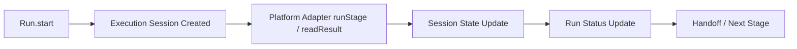

# FoxPilot 第二阶段执行会话生命周期

## 1. 文档目的

这份文档只定义一件事：

> 第二阶段如何把平台上的一次真实执行收成正式的 Execution Session，而不是只在 `run` 里塞几个状态字段。

如果没有这层模型，后面会出现：

- `externalRunId` 只是一根孤立字符串
- UI 很难判断当前运行到底卡在哪
- 平台轮询、结果回收、取消操作都没有统一对象承接

## 2. 模型定位

第二阶段必须区分：

```text
Task
Run
Execution Session
```

### 2.1 Task

表示：

```text
业务对象
```

### 2.2 Run

表示：

```text
某一阶段的一次执行尝试
```

### 2.3 Execution Session

表示：

```text
这个 Run 在某个平台上的真实执行会话
```

## 3. 总链



## 4. 为什么 Run 不能直接替代 Session

因为 `Run` 关注的是业务阶段推进，`Session` 关注的是平台执行过程。

例如：

- 是否已经拿到 `externalRunId`
- 最近一次轮询是什么时候
- 平台端是否还在运行
- 是否进入结果回收阶段

这些都更适合挂在 `Session`，而不是直接污染 `Run`。

## 5. 正式结构

建议第二阶段统一为：

```ts
interface ExecutionSession {
  sessionId: string
  runId: string
  taskId: string
  platformId: PlatformId | 'manual'
  externalRunId: string | null
  status: ExecutionSessionStatus
  startedAt: string | null
  lastPolledAt: string | null
  finishedAt: string | null
  resultSummary: string | null
  errorDetail: string | null
}
```

其中：

```ts
type ExecutionSessionStatus =
  | 'prepared'
  | 'starting'
  | 'running'
  | 'collecting'
  | 'completed'
  | 'failed'
  | 'blocked'
  | 'cancelled'
  | 'timed_out'
```

## 6. 第一批生命周期

建议第二阶段第一批固定为：

```text
prepared
-> starting
-> running
-> collecting
-> completed / failed / blocked / cancelled / timed_out
```

## 7. 各状态含义

### 7.1 prepared

说明：

```text
Run 已建立，但平台还没真正发起
```

### 7.2 starting

说明：

```text
已调用平台适配器，正在尝试获取 externalRunId
```

### 7.3 running

说明：

```text
平台端已经在执行
```

### 7.4 collecting

说明：

```text
平台主执行已结束，Runtime 正在回收结果
```

### 7.5 completed / failed / blocked / cancelled / timed_out

说明：

```text
终态
```

## 8. Session 与平台适配器的关系

平台适配器负责：

```text
runStage
readResult
cancelRun
```

但正式状态机不应散在适配器里，而应由：

```text
Execution Session Service
```

统一推进。

## 9. Session 与 UI 的关系

桌面端 Runs 页和右侧详情不应只展示：

```text
run status
```

还应展示：

```text
session status
platform
externalRunId
lastPolledAt
结果回收状态
```

这样用户才能看懂：

- 现在是还没启动
- 还是平台正在跑
- 还是平台跑完但结果没回收

## 10. Session 与取消动作的关系

`run.cancel` 不应直接等于：

```text
run status = cancelled
```

正确链路应是：

```text
run.cancel
-> session.cancel requested
-> platform adapter cancelRun
-> session 状态更新
-> run 状态更新
```

## 11. Session 与 handoff 的关系

只有当 `Execution Session` 进入稳定终态，并且结果已回收后，才允许进入：

```text
handoff
```

也就是：

```text
session complete
-> run complete
-> handoff prepare
```

而不是平台一返回就立即切下一阶段。

## 12. 第一批范围控制

第二阶段第一批先不做：

- 一个 Run 对应多个并行 Session
- 跨平台迁移中的热切换
- 长时间断点续跑

先固定：

```text
一个 Run
对应一个主 Session
```

## 13. 审核点

你审核这份生命周期时，重点看：

```text
1  是否接受 Task / Run / Execution Session 三层区分
2  是否接受 Execution Session 成为平台执行过程的正式对象
3  是否接受 completed 之前必须经过 collecting
4  是否接受 cancel / handoff 都必须先经过 Session 状态机
```
