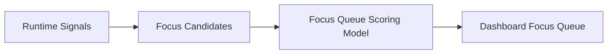

# FoxPilot 第二阶段 Focus Queue 评分模型

## 1. 文档目的

这份文档只定义一件事：

> Dashboard 首页里的 Focus Queue 应该如何从候选对象中打分、筛选、排序，最终给出 3 到 7 个最值得处理的事项。

如果没有这层评分模型，后面很容易出现：

- Focus Queue 只是静态规则堆叠
- 首页高亮项不稳定
- 用户看不出为什么某个对象排在前面

## 2. 定位

Focus Queue 不是：

- 普通任务列表
- 最近更新列表
- 失败运行列表

它是：

> 首页最值得立刻处理对象的统一排序层。

## 3. 总链



## 4. 第一原则

Focus Queue 应优先突出：

```text
高影响
高确定性
高可行动性
```

而不是单纯：

```text
最近更新
数量最多
看起来热闹
```

## 5. 第一批候选对象类型

建议第二阶段先支持：

```text
foundation_issue
config_issue
failed_run
blocked_handoff
degraded_platform
degraded_skill
degraded_mcp
missing_binding
pending_confirmation
high_priority_task
stalled_session
```

## 6. 第一批评分维度

建议统一按这 6 个维度评分：

```text
severity            严重程度
workflowCriticality 工作流关键程度
actionability       当前是否能立刻处理
userImpact          对用户当前目标影响
recency             新近程度
noisePenalty        噪声惩罚
```

## 7. 推荐评分权重

第一批建议采用：

```text
severity            30
workflowCriticality 25
actionability       20
userImpact          15
recency             10
noisePenalty       -20 ~ 0
```

也就是说：

```text
高严重 + 高关键 + 高可行动
必须明显高于
“只是最近发生”
```

## 8. 第一批优先级直觉

第二阶段首页优先级建议固定为：

```text
1  foundation / config 阻塞
2  failed run / blocked handoff
3  missing binding / stalled session
4  degraded platform / skill / mcp
5  可推进的高优任务
```

## 9. 评分结果结构

建议第二阶段统一为：

```ts
interface DashboardFocusItem {
  kind: string
  targetId: string
  title: string
  summary: string
  score: number
  reasons: string[]
  recommendedAction: string
  relatedTargets: Array<{ kind: string; id: string }>
}
```

## 10. 为什么必须输出 reasons

Focus Queue 不应该是黑盒排序。

第二阶段必须能解释：

```text
为什么它排第 1
为什么它比另一个 failed run 更值得处理
```

所以 `reasons` 必须成为正式字段。

## 11. 去噪规则

第二阶段必须限制这些噪声：

- 同一对象短时间重复进入队列
- 同一类 degraded 对象刷满首页
- 低可行动性的旧问题长期占位

第一批建议：

```text
同一目标最多出现 1 次
同一类型最多出现 2 次
actionability 很低的对象需要明显降权
```

## 12. 队列长度建议

第二阶段首页建议固定：

```text
3 到 7 个对象
```

不要做太长。

过长就会退化成另一个列表页。

## 13. 与 Dashboard 聚合模型的关系

Dashboard 聚合模型回答：

```text
首页有哪些块
```

这份评分模型回答：

```text
首页最值得立刻点开的对象是谁
```

两者缺一不可。

## 14. 第一批范围控制

第二阶段第一批先不做：

- 个性化学习排序
- 用户自定义权重
- 时间趋势修正
- 跨会话历史偏好

先固定：

```text
稳定候选类型
稳定权重
稳定 reasons
稳定去噪规则
```

## 15. 审核点

你审核这份模型时，重点看：

```text
1  是否接受 Focus Queue 以“高影响 + 高可行动性”优先，而不是最近更新优先
2  是否接受 foundation / config / failed run / blocked handoff / degraded 平台类对象进入同一队列
3  是否接受 score + reasons 一起成为正式输出
4  是否接受第二阶段首页 Focus Queue 固定为 3 到 7 项
```
