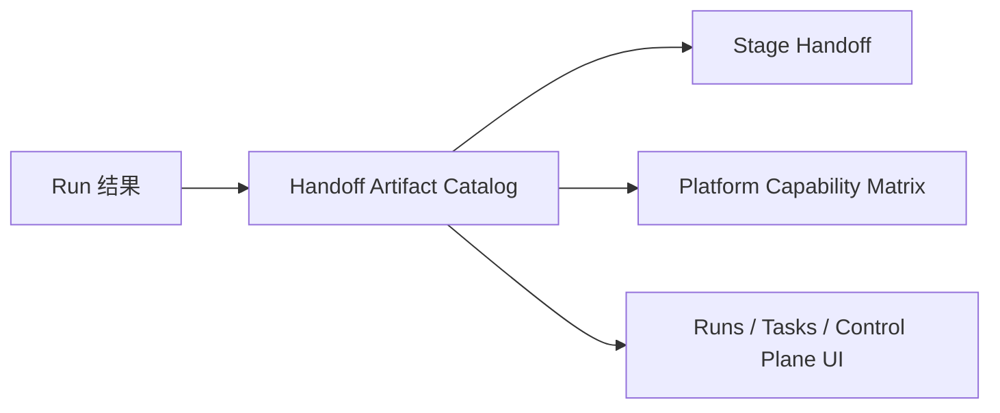

# FoxPilot 第二阶段交接产物目录

## 1. 文档目的

这份文档只定义一件事：

> 第二阶段里，阶段交接时允许出现哪些正式产物，以及这些产物如何被平台、模板和页面统一消费。

如果没有这份目录，后面会出现：

- `handoff.artifacts` 只是任意字符串数组
- Platforms 页说不清自己能消费什么
- Runs 页和 Tasks 页也没法稳定展示结果

## 2. 目录定位

交接产物目录不是：

- 某个平台自己的内部文件格式
- 页面临时拼出来的附件列表
- 任务描述字段的替代品

它是：

> Runtime Core、Workflow Template、Platform Capability Matrix 和 Handoff 模型之间共享的正式产物词表。

## 3. 总链



## 4. 为什么必须有统一目录

第二阶段已经确定：

```text
不同阶段
不同角色
不同平台
```

所以系统必须回答：

- 上一阶段到底交付了什么
- 下一平台能不能消费它
- 页面应该怎么展示它

如果没有统一目录，这三件事会完全脱节。

## 5. 正式产物结构

建议第二阶段统一为：

```ts
interface HandoffArtifactDescriptor {
  artifactId: string
  type: ArtifactType
  producerStage: StageId | null
  producerRole: RoleId | null
  producerPlatform: PlatformId | 'manual' | null
  format: 'text' | 'markdown' | 'json' | 'file-ref'
  summary: string
  valueRef: string | null
  createdAt: string
}
```

## 6. 第一批 ArtifactType

建议第二阶段第一批固定：

```text
design_brief
implementation_plan
code_change_summary
test_report
review_findings
repair_note
context_snapshot
```

## 7. 每类产物的语义

### 7.1 design_brief

用途：

```text
设计阶段交给实现阶段的正式摘要
```

### 7.2 implementation_plan

用途：

```text
分析或设计阶段产出的实施拆解
```

### 7.3 code_change_summary

用途：

```text
实现阶段交给验证或评审阶段的变更说明
```

### 7.4 test_report

用途：

```text
验证阶段交给修复或评审阶段的测试结果
```

### 7.5 review_findings

用途：

```text
评审阶段输出的问题与建议
```

### 7.6 repair_note

用途：

```text
修复阶段输出的问题定位和修复说明
```

### 7.7 context_snapshot

用途：

```text
跨阶段都可复用的上下文快照
```

## 8. 产物如何进入平台能力矩阵

平台能力矩阵里必须声明：

```text
consumesArtifacts
producesArtifacts
```

这样系统才能知道：

- `codex` 是否适合吃 `design_brief`
- `qoder` 是否适合产出 `test_report`

## 9. 产物如何进入 Workflow Template

模板里也必须声明：

```text
某个阶段交接时需要哪些 artifacts
```

例如：

- `design -> implement` 需要 `design_brief`
- `implement -> verify` 需要 `code_change_summary`
- `verify -> repair` 需要 `test_report`

## 10. 页面如何展示

### 10.1 Runs 页面

显示：

```text
本次运行产出了哪些 artifacts
```

### 10.2 Tasks 页面

显示：

```text
当前阶段已收到哪些 handoff artifacts
```

### 10.3 Control Plane

显示：

```text
哪些平台支持哪些 artifact 类型
```

## 11. 第一批范围控制

第二阶段第一批先不做：

- 二进制大文件编排
- 复杂版本化 artifact diff
- artifact lineage 图谱

先固定：

```text
少量结构化产物类型
稳定目录
稳定展示
```

## 12. 审核点

你审核这份目录时，重点看：

```text
1  是否接受 artifact 类型成为正式词表，而不是自由字符串
2  是否接受第一批 7 类核心产物
3  是否接受平台矩阵和工作流模板都必须引用这份目录
4  是否接受 Runs / Tasks / Control Plane 都按同一份目录展示
```
