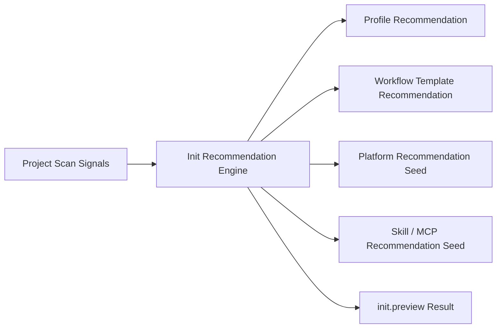

# FoxPilot 第二阶段 Init 推荐引擎模型

## 1. 文档目的

这份文档只定义一件事：

> 第二阶段 `init.preview` 如何把项目扫描信号转成 profile、workflow template、平台与依赖建议。

如果没有这层引擎，后面会出现：

- `init.preview` 只是拼几个字段
- 页面能看到信号，但看不到推荐逻辑
- 用户无法理解为什么系统建议这个模板和这些平台

## 2. 模型定位

推荐引擎不是：

- 最终生效配置
- 单个平台的解析器
- doctor/repair 的执行器

它是：

> Init Wizard 在真正写配置之前的统一建议层

## 3. 总链



## 4. 推荐引擎必须回答的问题

它至少要回答：

```text
推荐哪个 profile
推荐哪个 workflow template
推荐哪些 stage / role / platform
推荐补哪些 skills / mcp
有哪些阻塞项
这些建议是根据什么得出的
```

## 5. 正式输出结构

建议第二阶段统一为：

```ts
interface InitRecommendationResult {
  profile: RecommendationItem<ProfileId>
  workflowTemplate: RecommendationItem<string>
  stagePlan: StagePlanRecommendation[]
  bindings: BindingRecommendation[]
  blockers: string[]
  warnings: string[]
}
```

其中：

```ts
interface RecommendationItem<T> {
  recommended: T
  reasons: string[]
  alternatives: T[]
}
```

## 6. Profile 推荐规则

建议第二阶段第一批固定：

### 6.1 default

适用：

- 标准软件项目
- 本机基础组合齐全
- 需要完整协作主链

### 6.2 collaboration

适用：

- 只想先接入任务协作
- 平台或部分依赖尚不稳定

### 6.3 minimal

适用：

- 当前环境明显不完整
- 用户只想先接管项目

## 7. Workflow Template 推荐规则

建议第一批：

```text
standard-software
fast-bugfix
docs-heavy
```

推荐依据来自：

- `likelyProjectType`
- 测试信号
- docs 比例
- 仓库结构

## 8. 平台推荐种子

这里不直接给最终生效平台，而是给：

```text
每个阶段的推荐种子
```

例如：

```text
design     -> codex
implement  -> claude_code
verify     -> qoder
repair     -> trae
```

然后最终仍然要进入：

```text
Platform Resolver
```

## 9. Binding 推荐种子

推荐引擎还应生成：

```text
哪些 skill / mcp 建议补齐
哪些只是推荐
哪些会阻塞
```

这样 `init.preview` 才能给用户有用的建议，而不是只告诉他“选了 default”。

## 10. 推荐与覆盖的关系

推荐引擎只负责：

```text
recommended
```

它不决定：

```text
effective
```

最终仍然由：

```text
Override Precedence Policy
+ Runtime Resolution
```

共同决定生效值。

## 11. 推荐解释必须可见

第二阶段桌面端必须能展示：

```text
推荐值
推荐理由
备选值
阻塞项
```

否则 `init.preview` 只会像黑盒。

## 12. 第一批范围控制

第二阶段第一批先不做：

- 机器学习式推荐
- 用户画像推荐
- 历史项目个性化推荐

先固定：

```text
规则驱动
可解释
可审计
```

## 13. 审核点

你审核这份引擎时，重点看：

```text
1  是否接受推荐引擎只产出 recommended，不直接决定 effective
2  是否接受 profile / workflow / bindings / stagePlan 四类推荐同时产出
3  是否接受 design->codex / implement->claude_code / verify->qoder / repair->trae 作为第一批推荐种子
4  是否接受推荐结果必须带 reasons 和 alternatives
```
