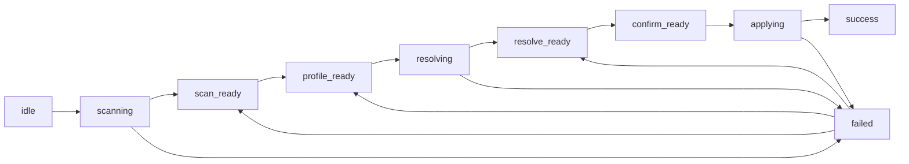

# FoxPilot 第二阶段 Init Wizard 状态机

## 1. 文档目的

这份文档只定义一件事：

> `Project Init Wizard` 在第二阶段里，页面状态如何推进、回退、失败和完成。

之前的交互流文档已经定义了：

- 一共几步
- 每步展示什么
- 按钮叫什么

但还缺一层更硬的定义：

- 哪些状态是页面状态
- 哪些状态是 Runtime 状态
- 哪些步骤可以回退
- 哪些步骤执行后不允许静默跳过

## 2. 状态机定位

Init Wizard 状态机夹在两层之间：

```text
UI 步骤流
-> Init Wizard 状态机
-> Runtime 命令
```

它只负责：

> 把“项目初始化向导”定义成一条稳定、可恢复、可解释的状态机。

## 3. 顶层状态

第二阶段建议把 Init Wizard 状态拆成：

```text
idle
scanning
scan_ready
profile_ready
resolving
resolve_ready
confirm_ready
applying
success
failed
```

## 4. 状态图



## 5. 提交协议

Init Wizard 的核心提交分三次，不是一把梭提交所有内容：

### 5.1 第一次提交：扫描

```text
init.scan
```

### 5.2 第二次提交：预览

```text
init.preview
```

### 5.3 第三次提交：应用

```text
init.apply
```

## 6. 可回退规则

### 6.1 允许回退

```text
scan_ready     -> idle / scanning
profile_ready  -> scan_ready
resolve_ready  -> profile_ready
confirm_ready  -> resolve_ready
```

### 6.2 不允许回退

```text
applying
success
```

## 7. 失败恢复规则

### 7.1 `scanning` 失败

回到：

```text
idle
```

### 7.2 `resolving` 失败

回到：

```text
profile_ready
```

### 7.3 `applying` 失败

回到：

```text
confirm_ready
```

并提示用户：

- 是否建议重试
- 是否先去看 `Foundation / Health`
- 是否已有部分配置写入

## 8. 页面态与 Runtime 态边界

页面状态机不应该直接等于 Runtime 命令状态。

例如：

```text
页面状态     = resolving
Runtime 命令 = init.preview
```

页面状态关注：

- 当前在哪个步骤
- 是否允许前进 / 后退 / 提交

Runtime 状态关注：

- 命令是否成功
- 返回了什么数据
- 错误码是什么

## 9. 与 Desktop Bridge 的关系

Init Wizard 状态机最终通过 `Desktop Bridge` 调：

```text
init.scan
init.preview
init.apply
```

页面只依赖：

- 当前状态
- 当前步骤数据
- 当前错误
- Runtime 返回结果

## 10. 审核点

你审核这份状态机时，重点看：

```text
1  是否接受扫描 / 预览 / 应用 三段提交协议
2  是否接受 applying 阶段禁止回退和重复提交
3  是否接受 resolving 失败回退到 profile_ready
4  是否接受页面状态与 Runtime 命令状态分层
```
