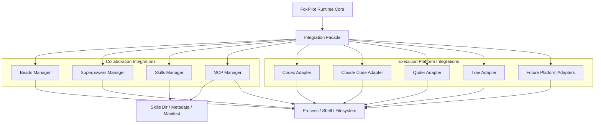

# FoxPilot 第二阶段集成层子架构图

## 1. 文档目的

这份文档只解释一个问题：

> FoxPilot 第二阶段如何接入外部本地能力和执行平台。

这里不讨论页面，不讨论 CLI 文案，只固定：

- 集成层的正式分组
- `Runtime Core` 与集成层的交互方式
- 后续 `Codex / Claude Code / Qoder / Trae` 扩展时不返工的边界

## 2. 集成层正式定位

第二阶段的集成层不是“工具调用杂物间”，而是：

> Runtime Core 与外部本地能力之间的统一接入层

这意味着：

- Runtime Core 不直接散落调用 `beads`、`skills`、`mcp`
- Desktop 页面不能直接操作这些能力
- CLI 入口也不能自己绕过 Runtime 去做工具接入

所有外部能力都必须先进入集成层，再由 Runtime Core 编排。

## 3. 集成层总图



## 4. 为什么要拆成两组

### 4.1 协作集成层

这一组解决的是：

```text
任务来源
基础方法能力
技能与 MCP 管理
本地协作环境
```

当前包含：

- `Beads`
- `Superpowers`
- `Skills`
- `MCP`

### 4.2 执行平台集成层

这一组解决的是：

```text
哪个平台负责某个阶段 / 某个角色的执行
```

当前和未来包含：

- `Codex`
- `Claude Code`
- `Qoder`
- `Trae`
- 未来平台

如果现在不拆开，后面会把“协作能力管理”和“执行平台调度”混成一层。

## 5. Integration Facade

`Integration Facade` 是集成层统一入口。

它负责：

- 给 Runtime Core 暴露统一调用面
- 隐藏各工具的调用差异
- 统一错误模型
- 统一能力探测结果
- 控制权限和越层访问

它不负责：

- 任务状态流转
- 阶段推进
- 平台分配规则

## 6. 协作集成层职责

### 6.1 Beads Manager

负责：

- `Beads` 环境探测
- `bd` 本地命令调用
- hooks、doctor、sync、diff、push、export 等包装
- 返回统一结构化结果

不负责：

- 决定是否创建任务
- 决定是否关闭任务
- 直接改任务状态

### 6.2 Superpowers Manager

负责：

- `Superpowers` 是否存在
- 安装、修复、状态读取
- 能力版本探测

它是基础能力管理器，不是业务管理器。

### 6.3 Skills Manager

负责：

- 已安装技能清单
- 技能元数据
- 技能安装 / 卸载 / 启停
- 技能目录一致性检查

### 6.4 MCP Manager

负责：

- MCP 配置读取
- MCP 服务发现
- MCP 启停状态探测
- MCP 配置修复

它是桌面端 `MCP` 管理页背后的正式服务入口。

## 7. 执行平台集成层职责

执行平台集成层不能再写成“Codex 执行器适配层”，因为未来一定是多平台。

### 7.1 平台适配器统一契约

每个平台适配器都应实现统一能力模型，例如：

```text
detect()
doctor()
prepareContext()
runStage()
readResult()
cancelRun()
```

这样 Runtime Core 才能按统一契约调平台，而不是写死平台细节。

### 7.2 Codex Adapter

负责：

- `Codex` 可用性探测
- 适用能力探测
- 某阶段执行包装
- 标准执行结果返回

### 7.3 Claude Code Adapter

负责：

- `Claude Code` 可用性探测
- 编码 / 文档 / 其他能力声明
- 阶段执行包装

### 7.4 Qoder Adapter

负责：

- `Qoder` 可用性探测
- 验证 / 检查能力声明
- 阶段执行包装

### 7.5 Trae Adapter

负责：

- `Trae` 可用性探测
- 修复 / 辅助执行能力声明
- 阶段执行包装

### 7.6 Future Platform Adapters

预留未来平台接入，不动 Runtime Core 主逻辑。

## 8. Runtime Core 与集成层的交互原则

固定交互方向：

```text
Runtime Core
-> Integration Facade
-> 某个 Manager / 某个平台 Adapter
-> Process / Filesystem
```

不允许：

```text
Runtime Core -> 直接 spawn beads
Runtime Core -> 直接写 MCP 配置
Runtime Core -> 直接操作 skills 目录
Runtime Core -> 直接调某个平台命令并自己拼能力判断
```

## 9. 错误边界

集成层建议统一返回三种健康状态：

```text
ready
degraded
unavailable
```

错误码建议至少稳定这些：

```text
TOOL_NOT_INSTALLED
TOOL_NOT_CONFIGURED
TOOL_COMMAND_FAILED
TOOL_STATE_INVALID
TOOL_PERMISSION_DENIED
PLATFORM_CAPABILITY_MISMATCH
PLATFORM_UNAVAILABLE
```

这样：

- Desktop 能稳定渲染状态
- CLI 能稳定输出
- Runtime 能稳定做恢复、回退和换平台

## 10. 硬边界

### 10.1 Desktop 不能直接碰集成层

Desktop 页面不能直接：

- 调 `bd`
- 改 `skills` 目录
- 改 `mcp` 配置
- 调 `codex` / `claude code` / `qoder` / `trae`

Desktop 只能发起 Runtime 命令。

### 10.2 CLI 不能绕开 Runtime

CLI 负责入口和脚本化，不应自己复制一套集成决策逻辑。

### 10.3 集成层不能反向改业务状态

集成层不能直接改：

- `task`
- `run`
- `event`

它只能返回：

- 能力探测结果
- 执行结果
- 健康状态

真正状态推进必须回到 Runtime Core。

## 11. 第一批实现优先级

第二阶段第一批建议优先：

```text
1  Beads Manager
2  Superpowers Manager
3  Skills Manager
4  MCP Manager
5  Codex Adapter
6  Claude Code Adapter 预留
7  Qoder Adapter 预留
8  Trae Adapter 预留
```

原因：

- `Beads + Superpowers` 是基础组合
- `Skills / MCP` 是桌面端管理重点
- 执行平台层第一批先把契约搭起来，再逐步接多个平台

## 12. 审核点

你审核这份文档时，重点看 4 件事：

```text
1  是否接受“所有外部能力必须先过集成层”
2  是否接受“协作集成层”和“执行平台集成层”分开
3  是否接受“平台适配器只返回能力结果，不直接改任务状态”
4  是否接受“Desktop 和 CLI 都不能绕开 Runtime Core”
```

## 13. 当前结论

第二阶段集成层已经收口为：

- `Integration Facade` 统一入口
- `Beads / Superpowers / Skills / MCP` 归协作集成层
- `Codex / Claude Code / Qoder / Trae / Future` 归执行平台集成层
- Runtime Core 统一编排
- Desktop / CLI 都不允许越层访问外部能力
