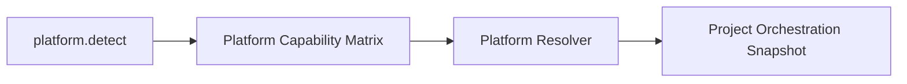

# FoxPilot 第二阶段平台能力矩阵

## 1. 文档目的

这份文档只定义一件事：

> 第二阶段如何用统一矩阵描述不同平台在阶段、角色、输入输出和依赖上的能力差异。

如果没有这层矩阵，后面会出现：

- `platform.detect` 只知道平台“在不在”
- `platform.resolve` 只能靠硬编码判断
- UI 只能看到平台名，看不到为什么推荐它

## 2. 矩阵定位

平台能力矩阵不是：

- 平台探测结果本身
- 平台健康检查结果本身
- 项目级最终选择结果

它是：

> Runtime Core 在解析平台之前使用的正式能力声明层

也就是：

```text
Detect 解决“是否存在”
Matrix 解决“擅长什么”
Resolve 解决“最终选谁”
```

## 3. 能力矩阵总链



## 4. 矩阵必须回答的问题

每个平台至少要回答：

```text
支持哪些阶段
更适合哪些角色
能消费什么交接产物
能产出什么结果产物
依赖哪些本地能力
有哪些明显边界
```

## 5. 正式能力结构

建议第二阶段统一为：

```ts
interface PlatformCapabilityProfile {
  platformId: PlatformId
  supportedStages: StageId[]
  preferredRoles: RoleId[]
  invocationModes: InvocationMode[]
  consumesArtifacts: ArtifactType[]
  producesArtifacts: ArtifactType[]
  requiredDependencies: string[]
  recommendedDependencies: string[]
  limits: string[]
}
```

其中：

```ts
type InvocationMode = 'cli' | 'sdk' | 'desktop' | 'manual'
```

## 6. 为什么不能只记录 supportedStages

如果平台能力只剩：

```text
支持 design
支持 implement
```

那系统仍然回答不了：

- 这个平台更适合 `designer` 还是 `coder`
- 它能不能吃 `design_brief`
- 它能不能产出 `test_report`

所以第二阶段必须把：

```text
阶段
角色
产物
依赖
边界
```

一起写进能力矩阵。

## 7. 第一批平台能力建议

### 7.1 Codex

```text
stage     analysis / design / review
role      analyst / designer / reviewer
mode      cli / sdk / desktop
consume   context_snapshot / review_findings / design_brief
produce   design_brief / review_findings / implementation_plan
```

### 7.2 Claude Code

```text
stage     analysis / implement / review
role      analyst / coder / reviewer
mode      cli / sdk
consume   design_brief / implementation_plan / context_snapshot
produce   code_change_summary / implementation_plan / review_findings
```

### 7.3 Qoder

```text
stage     verify / review
role      tester / reviewer
mode      cli / sdk
consume   code_change_summary / test_report / context_snapshot
produce   test_report / review_findings
```

### 7.4 Trae

```text
stage     repair / implement
role      fixer / coder
mode      cli / sdk
consume   test_report / repair_note / context_snapshot
produce   repair_note / code_change_summary
```

### 7.5 Manual

```text
stage     all
role      all
mode      manual
consume   all handoff artifacts
produce   manual summary
```

## 8. 依赖与边界

能力矩阵里还必须声明：

### 8.1 requiredDependencies

例如：

```text
平台可执行所必须存在的本地能力
```

### 8.2 recommendedDependencies

例如：

```text
更推荐配套的 Skills / MCP / 辅助工具
```

### 8.3 limits

例如：

```text
不擅长长链验证
更适合设计摘要
依赖本地 CLI
不应作为默认 repair 平台
```

## 9. 矩阵如何参与解析

建议第二阶段固定流程：

```text
1  Detect 拿到平台存在性与健康状态
2  Matrix 提供能力声明
3  Resolver 结合项目、profile、阶段、角色做评分
4  Snapshot 输出 recommended / effective / candidates
```

## 10. Desktop 里应该怎么展示

Platforms 页不应只显示：

```text
名字 / 版本 / 状态
```

还应展示：

```text
擅长阶段
推荐角色
支持输入产物
支持输出产物
关键限制
```

这样 Control Plane 才真正像中控，而不是软件清单。

## 11. 第一批范围控制

第二阶段第一批先不做：

- 平台能力的动态学习
- 平台能力的自动打分训练
- 平台能力的历史统计回写

先固定为：

```text
人工定义矩阵
Detect 实时状态
Resolver 评分
```

## 12. 审核点

你审核这份文档时，重点看：

```text
1  是否接受平台能力矩阵成为 Detect 与 Resolve 之间的正式层
2  是否接受能力不只描述 stage，还要描述 role / artifact / dependency / limits
3  是否接受 Codex / Claude Code / Qoder / Trae 的第一批能力定位
4  是否接受 Platforms 页面需要展示“能力画像”，而不只是版本和状态
```
