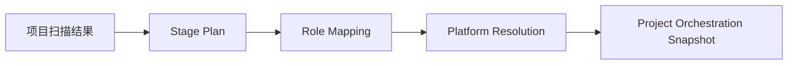

# FoxPilot 第二阶段平台解析结果模型

## 1. 文档目的

这份文档只定义一件事：

> 第二阶段里，`阶段 / 角色 / 平台` 最终是怎么被解析出来，并以什么结构落成项目级快照。

如果没有这层模型，后面会出现：

- `init` 页面展示一套平台推荐结果
- `Tasks` 页面展示另一套 stage / role / platform 字段
- `Run` 页面再拼第三套平台信息

最终用户根本看不清：

```text
为什么这个阶段用了这个平台
这个平台是自动推荐还是手动覆盖
下一阶段会不会切到别的平台
```

## 2. 模型定位

第二阶段已经确定：

```text
阶段 != 角色 != 平台
```

所以平台解析模型的职责不是“给任务塞一个 executor 字段”，而是：

1. 先定义阶段
2. 再为每个阶段解析角色
3. 再为每个阶段 / 角色选择平台
4. 输出统一快照给 `init`、`Tasks`、`Runs`、`Control Plane`

## 3. 解析总链



## 4. 解析输入

平台解析至少依赖这几类输入：

### 4.1 项目信号

```text
projectType
repositoryLayout
workspaceSignals
```

例如：

- `package.json`
- `pnpm-lock.yaml`
- `pyproject.toml`
- `Cargo.toml`
- `go.mod`

### 4.2 Profile

项目当前选中的：

```text
default
collaboration
minimal
```

Profile 不直接决定平台，但会限制可用能力和默认编排强度。

### 4.3 平台探测结果

来源于 `platform.detect` / `platform.doctor`：

```text
哪些平台存在
哪些平台健康
每个平台支持哪些能力
```

### 4.4 显式覆盖

用户或项目配置可能提供：

```text
project override
stage override
role override
manual fallback
```

## 5. 解析输出总结构

建议项目级最终快照统一为：

```ts
interface ProjectOrchestrationSnapshot {
  projectId: string
  generatedAt: string
  profileId: string
  stages: StageResolutionItem[]
}
```

其中每个阶段：

```ts
interface StageResolutionItem {
  stage: StageId
  role: RoleId
  platform: PlatformSelection
  requiredCapabilities: string[]
  blockingIssues: string[]
}
```

平台选择对象：

```ts
interface PlatformSelection {
  recommended: PlatformId | 'manual'
  effective: PlatformId | 'manual'
  source: 'user-override' | 'project-rule' | 'profile-rule' | 'auto-detect' | 'fallback'
  reasons: string[]
  candidates: PlatformCandidate[]
}
```

候选项：

```ts
interface PlatformCandidate {
  platformId: PlatformId | 'manual'
  score: number
  accepted: boolean
  reasons: string[]
}
```

## 6. 解析顺序

建议第二阶段固定解析优先级：

```text
1  user override
2  project rule
3  profile rule
4  auto-detect recommendation
5  manual fallback
```

这个顺序必须稳定，不然：

- `init` 页和 `Tasks` 页结果会飘
- 用户难以理解为什么平台切换

## 7. 为什么需要 recommended 和 effective

第二阶段里，不能只返回一个平台值。

必须区分：

```text
recommended  系统认为最适合的平台
effective    当前真正生效的平台
```

因为这两者可能不同。

例如：

```text
design
recommended = codex
effective   = claude_code
source      = user-override
```

这样用户才能知道：

- 系统原本建议什么
- 最终为什么用了别的平台

## 8. 为什么需要 candidates

如果只给最终结果，系统后面就很难解释：

```text
为什么没选 qoder
为什么 codex 只是推荐没生效
```

所以建议保留候选集，至少给：

```text
platformId
score
accepted
reasons
```

Desktop 右侧详情和 `platforms resolve` 都可以直接用这层数据。

## 9. 阶段与角色的固定关系

第二阶段第一批建议先固定一版默认映射：

```text
analysis   -> analyst
design     -> designer
implement  -> coder
verify     -> tester
repair     -> fixer
review     -> reviewer
document   -> documenter
```

后续可以扩，但第一批要先固定，不然平台解析没有稳定目标。

## 10. 平台解析失败时的处理

如果没有任何平台满足当前阶段要求，解析结果不能留空。

建议统一回退到：

```text
recommended = manual
effective   = manual
source      = fallback
```

并明确给出：

```text
blockingIssues
reasons
```

例如：

```text
未检测到支持 implement 阶段的可用平台
已回退到 manual
```

## 11. 这个模型会被哪些页面使用

### 11.1 Init Wizard

用于展示：

- 当前项目将采用的阶段序列
- 每个阶段的角色
- 每个阶段推荐的平台
- 为什么这么推荐

### 11.2 Tasks

用于展示：

- 当前任务所在阶段
- 该阶段的角色
- 当前生效平台

### 11.3 Runs

用于展示：

- 本次运行属于哪个阶段
- 本次阶段由哪个平台执行
- 该平台是推荐值还是覆盖值

### 11.4 Control Plane

用于展示：

- `platforms resolve`
- 某项目当前编排快照
- 候选平台与落选原因

## 12. 审核点

你审核这份模型时，重点看：

```text
1  是否接受 ProjectOrchestrationSnapshot 作为项目级编排快照
2  是否接受 recommended / effective / source 三段式平台选择结构
3  是否接受 candidates 作为解释层，不只保留最终值
4  是否接受 manual 作为正式回退平台，而不是空值
```
