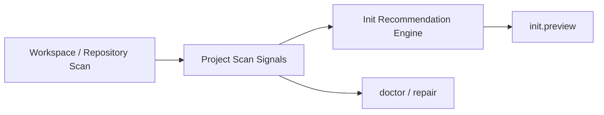

# FoxPilot 第二阶段项目扫描信号模型

## 1. 文档目的

这份文档只定义一件事：

> 第二阶段 `init.scan` 到底应该采集哪些项目信号，以及这些信号如何稳定供后续模板匹配、平台解析和 doctor 解释使用。

如果没有这层模型，后面会出现：

- `init` 页面只显示几个文件名
- `template / resolver / doctor` 各自读取一遍工作区
- 同一个项目在不同页面里被识别成不同类型

## 2. 模型定位

项目扫描信号不是：

- 最终项目类型结论
- 工作流模板本身
- 平台解析结果本身

它是：

> Runtime Core 对项目当前形态的统一观测层

也就是：

```text
scan signals
-> recommendation engine
-> template / platform / doctor 决策
```

## 3. 总链



## 4. 第一批信号分组

建议第二阶段第一批固定分成：

```text
structure signals
stack signals
workflow signals
health signals
integration signals
```

## 5. 正式结构

建议第二阶段统一为：

```ts
interface ProjectScanSignals {
  projectPath: string
  repositoryCount: number
  structure: StructureSignals
  stack: StackSignals
  workflow: WorkflowSignals
  health: HealthSignals
  integrations: IntegrationSignals
  scannedAt: string
}
```

## 6. Structure Signals

用于回答：

```text
这个项目长什么样
```

建议至少包含：

```ts
interface StructureSignals {
  repositoryLayout: 'single-repo' | 'multi-repo' | 'docs-heavy' | 'mixed'
  hasMonorepoMarkers: boolean
  hasNestedRepositories: boolean
  keyPaths: string[]
}
```

典型信号：

- `pnpm-workspace.yaml`
- `turbo.json`
- `.git` 层级
- `packages/`
- `apps/`
- `docs/`

## 7. Stack Signals

用于回答：

```text
这个项目主要是什么技术栈
```

建议至少包含：

```ts
interface StackSignals {
  languages: string[]
  packageManagers: string[]
  runtimeHints: string[]
  frameworkHints: string[]
}
```

典型信号：

- `package.json`
- `pnpm-lock.yaml`
- `pyproject.toml`
- `Cargo.toml`
- `go.mod`
- `requirements.txt`

## 8. Workflow Signals

用于回答：

```text
这个项目更像哪类工作流
```

建议至少包含：

```ts
interface WorkflowSignals {
  hasTests: boolean
  hasDocsEmphasis: boolean
  hasCiConfig: boolean
  likelyProjectType: 'standard-software' | 'fast-bugfix' | 'docs-heavy' | 'mixed'
}
```

典型信号：

- `tests/`
- `vitest.config.*`
- `pytest.ini`
- `.github/workflows/`
- `docs/`
- `README.md` 比例

## 9. Health Signals

用于回答：

```text
这个项目当前有没有明显阻塞
```

建议至少包含：

```ts
interface HealthSignals {
  missingProjectConfig: boolean
  missingFoundation: boolean
  missingRecommendedBindings: string[]
  brokenRepositoryRefs: string[]
}
```

## 10. Integration Signals

用于回答：

```text
这个项目已经接入了哪些协作能力
```

建议至少包含：

```ts
interface IntegrationSignals {
  hasBeads: boolean
  hasSuperpowers: boolean
  hasPlatforms: string[]
  hasSkills: string[]
  hasMcpServers: string[]
}
```

## 11. 为什么要把 Signals 单独抽出来

因为第二阶段至少有 3 套决策都要用它：

```text
init.preview
platform.resolve
doctor / repair
```

如果每套逻辑自己再扫一遍项目，结果一定不一致。

## 12. 第一批范围控制

第二阶段第一批先不做：

- 深度代码语义分析
- 跨仓库依赖图构建
- 自动复杂评分训练

先固定：

```text
稳定文件信号
稳定目录信号
稳定工具链信号
```

## 13. 审核点

你审核这份模型时，重点看：

```text
1  是否接受 structure / stack / workflow / health / integrations 五组信号
2  是否接受 ProjectScanSignals 成为 init.preview / doctor 的共同输入
3  是否接受 likelyProjectType 只是信号结论，不是最终模板
4  是否接受第二阶段先基于文件与目录信号，不做深度语义扫描
```
