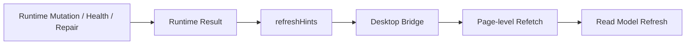

# FoxPilot 第二阶段读模型刷新策略

## 1. 文档目的

这份文档只定义一件事：

> 第二阶段桌面端的读模型在什么情况下刷新、刷新哪些区域、由谁发出刷新提示。

前面已经有：

- Desktop Bridge 契约
- 页面级数据契约
- 中控注册表更新与事件模型

这份文档把“刷新”正式收口，避免实现时回到：

```text
操作完就整页重刷
或者
每个页面自己猜该刷什么
```

## 2. 刷新策略定位

第二阶段刷新策略应遵守：

```text
Runtime 决定发生了什么
Bridge 传递 refreshHints
页面决定具体重拉哪些读模型
```

也就是说：

- Runtime 不直接操作页面
- 页面不直接猜业务后果
- Bridge 不自己发明业务规则

## 3. 刷新信号集合

第二阶段建议固定一组正式刷新信号：

```text
dashboard
projects
tasks
runs
events
controlPlane
health
projectInit
```

## 4. 刷新责任链



## 5. 查询操作的刷新规则

纯查询命令通常不触发刷新。

例如：

```text
task.list
task.show
platform.inspect
controlPlane.overview
```

默认：

```text
changed = false
refreshHints = []
```

## 6. 变更操作的刷新规则

### 6.1 Init

```text
init.apply
-> projectInit
-> dashboard
-> tasks
-> health
-> controlPlane
```

### 6.2 Platforms

```text
platform.detect
-> controlPlane
-> projectInit

platform.doctor
-> controlPlane
-> health

platform.resolve
-> controlPlane
-> projectInit
-> tasks
```

### 6.3 Skills

```text
skill.install
-> controlPlane
-> health

skill.uninstall
-> controlPlane
-> health

skill.enable
-> controlPlane

skill.disable
-> controlPlane

skill.doctor
-> controlPlane
-> health

skill.repair
-> controlPlane
-> health
```

### 6.4 MCP

```text
mcp.add
-> controlPlane
-> health

mcp.remove
-> controlPlane
-> health

mcp.enable
-> controlPlane

mcp.disable
-> controlPlane

mcp.doctor
-> controlPlane
-> health

mcp.repair
-> controlPlane
-> health

mcp.restart
-> controlPlane
-> health
```

## 7. 页面如何消费刷新信号

### 7.1 Dashboard

只关心：

```text
dashboard
health
controlPlane
```

### 7.2 Tasks

只关心：

```text
tasks
runs
projectInit
```

### 7.3 Runs

只关心：

```text
runs
tasks
events
```

### 7.4 Control Plane

只关心：

```text
controlPlane
health
projectInit
```

### 7.5 Project Init Wizard

只关心：

```text
projectInit
controlPlane
health
```

## 8. 刷新节流原则

第二阶段不建议每收到一个 `refreshHint` 就立刻全量拉取。

建议前端实现时遵守：

```text
同一事件循环内合并相同 hint
同一页面优先只刷新当前已挂载读模型
详情面板按需刷新，不强制跟列表全刷
```

## 9. 为什么要单独写这份策略

因为第二阶段桌面端会越来越像中控平台。

如果刷新策略不先固定，后面一定会发生：

- Skills 修复后 Dashboard 被无意义重刷
- Platform detect 后 Tasks 没刷新
- Init apply 后 Control Plane 还是旧摘要

所以刷新策略必须变成正式契约。

## 10. 审核点

你审核这份刷新策略时，重点看：

```text
1  是否接受 refreshHints 作为唯一正式刷新提示
2  是否接受不同页面只消费自己关心的 hint
3  是否接受查询命令默认不触发刷新
4  是否接受 init / platform / skill / mcp 各自的刷新映射表
```
