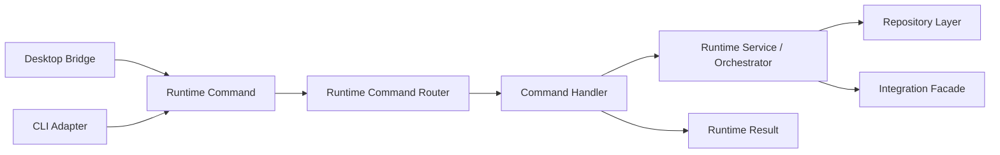

# FoxPilot 第二阶段 Runtime 命令模型

## 1. 文档目的

这份文档只定义一件事：

> Desktop、CLI 和未来自动化入口，如何通过同一套 Runtime 命令模型驱动 `Runtime Core`。

如果没有这层模型，后面很容易出现：

- Desktop Bridge 有一套动作结构
- CLI Adapter 有另一套参数结构
- Runtime Core 内部 Service 又各自收不同参数

最终结果就是：

```text
入口多了
核心没有统一命令语言
后续 Platforms / Skills / MCP 一扩就乱
```

## 2. 命令模型定位

第二阶段正式采用：

> 双入口 + 共享 Runtime 命令模型

也就是：

```text
Desktop
-> Desktop Bridge
-> Runtime Command
-> Runtime Core

CLI
-> CLI Adapter
-> Runtime Command
-> Runtime Core
```

这层模型的职责是：

- 统一命令命名
- 统一参数结构
- 统一返回包络
- 统一错误语义
- 统一查询类与变更类边界

它不负责：

- 页面渲染
- Shell 参数解析细节
- Repository 原始读写
- Beads / Skills / MCP 的具体调用实现

## 3. 总体处理链



## 4. 基础结构

### 4.1 Runtime Command

建议统一结构如下：

```ts
interface RuntimeCommand<TPayload = Record<string, unknown>> {
  name: string
  category: 'query' | 'mutation' | 'health' | 'repair'
  payload: TPayload
  context: RuntimeCommandContext
}
```

### 4.2 Runtime Command Context

```ts
interface RuntimeCommandContext {
  requestId: string
  source: 'desktop' | 'cli' | 'automation'
  locale: string
  cwd: string | null
  workspaceRoot: string | null
  projectId: string | null
  actor: 'user' | 'system'
  triggeredBy: string | null
}
```

### 4.3 设计原则

- `payload` 只放业务参数
- `context` 只放调用环境和来源
- `source` 不能替代业务字段
- `requestId` 必须能贯穿日志、事件和错误

## 5. 命令命名空间

第二阶段建议统一使用点式命名：

```text
foundation.*
init.*
task.*
run.*
event.*
controlPlane.*
platform.*
skill.*
mcp.*
health.*
```

这样做的目的是让：

- Runtime Core 内部命令
- Desktop 动作映射
- CLI `--json` 契约

都共用一套语言。

## 6. 第一批正式命令

### 6.1 Foundation

```text
foundation.inspect
foundation.install
foundation.doctor
foundation.repair
```

### 6.2 Init

```text
init.scan
init.preview
init.apply
```

### 6.3 Workflow

```text
task.list
task.show
task.history
run.show
event.list
health.summary
```

### 6.4 Control Plane

```text
controlPlane.overview
platform.list
platform.inspect
platform.detect
platform.doctor
platform.capabilities
platform.resolve

skill.list
skill.inspect
skill.install
skill.uninstall
skill.enable
skill.disable
skill.doctor
skill.repair

mcp.list
mcp.inspect
mcp.add
mcp.remove
mcp.enable
mcp.disable
mcp.doctor
mcp.repair
mcp.restart
```

## 7. 查询类与变更类边界

### 7.1 Query

典型命令：

```text
task.list
task.show
platform.list
platform.inspect
skill.list
mcp.inspect
controlPlane.overview
```

约束：

- 不改状态
- 不触发安装 / 修复
- 必须可安全重复调用

### 7.2 Mutation

典型命令：

```text
init.apply
skill.install
skill.enable
mcp.add
mcp.disable
```

约束：

- 必须定义副作用范围
- 必须返回变更摘要
- 需要明确是否支持回滚

### 7.3 Health

典型命令：

```text
foundation.doctor
platform.doctor
skill.doctor
mcp.doctor
health.summary
```

约束：

- 以检测为主
- 可以返回建议动作
- 不应默认修改系统状态

### 7.4 Repair

典型命令：

```text
foundation.repair
skill.repair
mcp.repair
```

约束：

- 必须明确风险等级
- 必须可在 Desktop 中要求确认
- 必须回传修复前后差异摘要

## 8. Runtime Result 模型

### 8.1 成功返回

```ts
interface RuntimeResult<TData = Record<string, unknown>> {
  ok: true
  command: string
  data: TData
  warnings?: RuntimeWarning[]
  meta: RuntimeResultMeta
}
```

### 8.2 失败返回

```ts
interface RuntimeFailure {
  ok: false
  command: string
  error: RuntimeError
  meta: RuntimeResultMeta
}
```

### 8.3 Meta

```ts
interface RuntimeResultMeta {
  requestId: string
  source: 'desktop' | 'cli' | 'automation'
  timestamp: string
  changed: boolean
  followUpActions?: string[]
}
```

### 8.4 Error

```ts
interface RuntimeError {
  code: string
  message: string
  details?: Record<string, unknown>
  retryable?: boolean
}
```

## 9. Handler 与 Service 的边界

### 9.1 Handler

负责：

- 校验命令名
- 校验 `payload`
- 调用对应 Service / Orchestrator
- 组装统一 `RuntimeResult`

不负责：

- 持久化细节
- 平台探测逻辑
- Skills / MCP 目录操作细节

### 9.2 Service / Orchestrator

负责：

- 真正业务规则
- 阶段 / 角色 / 平台判断
- 调 Integration Facade
- 调 Repository Layer

不负责：

- 直接知道 Desktop 页面
- 直接知道 CLI 参数格式

## 10. Control Plane 与命令模型的关系

第二阶段中控平台的动作，不应该直接映射成“页面按钮逻辑”，而要先映射成 Runtime 命令。

例如：

```text
Platforms 页面点击“重新探测”
-> platform.detect

Skills 页面点击“修复”
-> skill.repair

MCP 页面点击“重启”
-> mcp.restart
```

这保证：

- Desktop 和 CLI 共用同一套业务入口
- 自动化任务以后也能复用同一命令
- 日后扩展到更多平台不需要重写 UI 逻辑

## 11. 为什么需要 controlPlane.overview

如果只有：

```text
platform.list
skill.list
mcp.list
```

Dashboard 和 Control Plane 首页就必须自己拼三次数据。

所以第二阶段建议正式增加：

```text
controlPlane.overview
```

它负责输出：

- 平台总数
- skills 总数
- mcp 总数
- `ready / degraded / unavailable` 汇总
- 最近一次 doctor / detect 时间

## 12. 后续扩展原则

后续如果增加：

- 新平台
- 新 Skill 来源
- 新 MCP 类型
- 新 Workflow 事件源

应优先做的不是“加页面按钮”，而是：

1. 新增 Runtime 命令
2. 新增 Handler 映射
3. 新增 Service / Integration 支持
4. 最后再接 Desktop / CLI

## 13. 审核点

你审核这份模型时，重点看：

```text
1  是否接受 Desktop / CLI / Automation 共用 Runtime 命令模型
2  是否接受 query / mutation / health / repair 四类命令分类
3  是否接受 controlPlane.overview 作为正式命令
4  是否接受所有中控动作先映射为 Runtime 命令，再进入 Service
```
