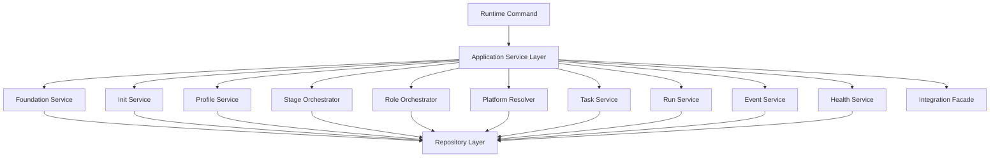

# FoxPilot 第二阶段 Runtime Core 内部架构

## 1. 文档目的

这份文档只解释一个问题：

> `Runtime Core` 内部到底怎么拆，才能同时支撑 Desktop、CLI 和未来多平台执行。

第二阶段最关键的决定不是 UI，而是：

> 共享核心要先把“阶段 / 角色 / 平台”抽出来。

## 2. Runtime Core 定位

`Runtime Core` 是第二阶段唯一业务核心。

它负责：

- Foundation 规则
- 项目初始化规则
- 项目协作 profile
- 阶段编排
- 角色编排
- 平台解析
- 任务 / 运行 / 事件状态流转
- 健康检查与修复建议

它不负责：

- 页面渲染
- CLI 参数解析
- 外部工具具体调用细节
- SQLite 的原始读写细节

## 3. Runtime Core 总图



## 4. 为什么要新增 Stage / Role / Platform

FoxPilot 后续不是“接多个执行器”这么简单，而是：

```text
不同阶段
由不同角色负责
再分配给不同平台执行
```

例如：

```text
design     -> designer -> codex
implement  -> coder    -> claude_code
verify     -> tester   -> qoder
repair     -> fixer    -> trae
```

所以 Runtime Core 里必须明确：

```text
阶段 != 角色 != 平台
```

如果现在还把“平台”直接当“执行器”，后面一定返工。

## 5. 模块职责

### 5.1 Application Service Layer

这是 Runtime Core 总入口。

负责：

- 接收来自 Desktop Bridge 或 CLI Adapter 的标准命令
- 调度具体 Service / Orchestrator
- 组织统一返回结果
- 统一错误码和事务边界

不负责：

- 直接访问 UI
- 直接解析终端参数

### 5.2 Foundation Service

负责：

- Foundation Pack 状态
- 基础组合安装 / 修复 / 校验
- 基础环境摘要

### 5.3 Init Service

负责：

- 项目扫描
- 仓库识别
- 初始化流程推进
- 初始化结果汇总

它是 `Project Init Wizard` 和 `foxpilot init` 共用核心。

### 5.4 Profile Service

负责：

- `default / collaboration / minimal`
- Profile 启用能力解释
- 项目协作模式快照

### 5.5 Stage Orchestrator

负责：

- 任务所处分阶段定义
- 阶段前后依赖
- 阶段推进规则
- 阶段切换条件

例如：

- `analysis -> design`
- `design -> implement`
- `implement -> verify`

### 5.6 Role Orchestrator

负责：

- 当前阶段需要的角色
- 阶段与角色的映射
- 角色交接关系

例如：

- `design -> designer`
- `implement -> coder`
- `verify -> tester`

### 5.7 Platform Resolver

负责：

- 平台可用性探测结果汇总
- 根据阶段和角色选择平台
- 用户显式覆盖与默认推荐合并
- 最终生效平台快照

这一层不该只返回 `codex`，而应该支持：

- `codex`
- `claude_code`
- `qoder`
- `trae`
- `manual`
- 未来平台

### 5.8 Task Service

负责：

- 任务创建
- 任务查询
- 任务属性更新
- 与阶段 / 角色 / 平台关联的任务读模型

### 5.9 Run Service

负责：

- 运行记录
- 运行状态
- 运行历史
- 运行与任务状态联动
- 平台执行结果回收

### 5.10 Event Service

负责：

- 事件记录
- hooks / sync / UI 动作等事件输入
- 事件到动作的编排关系

### 5.11 Health Service

负责：

- install-info
- doctor
- 环境健康摘要
- 可恢复项提示

## 6. Repository Layer

`Repository Layer` 负责：

- SQLite 访问
- 配置读取
- 工作区文件访问
- 本地读模型聚合

这一层只负责：

```text
拿数据
落数据
提供读模型
```

不负责：

- 业务规则判断
- 阶段推进
- 平台选择

## 7. Runtime Core 的固定边界

### 7.1 上边界

Runtime Core 上面只能是：

- `Desktop Bridge`
- `CLI Adapter`

也就是说，UI 和 CLI 都必须通过标准命令进入 Runtime Core。

### 7.2 下边界

Runtime Core 下面只能是：

- `Repository Layer`
- `Integration Facade`

不允许 Runtime Service 自己到处散落直接调用：

- SQLite
- `bd`
- `skills` 目录
- `mcp` 配置
- 某个平台命令

## 8. 统一命令模型建议

对外统一为：

```text
Command
-> Handler
-> Service / Orchestrator
-> Repository / Integration
-> Result
```

这能保证：

- Desktop 和 CLI 共用同一套调用方式
- 后面加 `Skills / MCP` 页面时，不需要发明第三套协议
- 后续平台扩展时不动入口层

## 9. 第一批优先实现模块

第二阶段 Runtime Core 第一批建议优先：

```text
1  Foundation Service
2  Init Service
3  Profile Service
4  Stage Orchestrator
5  Role Orchestrator
6  Platform Resolver
7  Task Service
8  Health Service
```

后续再补：

```text
Run Service
Event Service
更完整的平台结果回收
Skills / MCP 管理服务
```

## 10. 审核点

你审核这份设计时，重点看 4 件事：

```text
1  是否接受 Runtime Core 作为唯一业务核心
2  是否接受 Stage / Role / Platform 三层抽象
3  是否接受 Repository Layer 不做业务规则
4  是否接受 Desktop / CLI 只能通过标准命令进入 Runtime Core
```

## 11. 当前结论

第二阶段 Runtime Core 已经收口为：

- `Application Service Layer` 作为总入口
- `Foundation / Init / Profile / Stage / Role / Platform / Task / Run / Event / Health`
- `Repository Layer` 负责落地
- `Integration Facade` 负责外部能力接入

这套结构可以同时支撑：

- 第一阶段 CLI 承接
- 第二阶段桌面控制台
- 后续多平台分阶段协作
