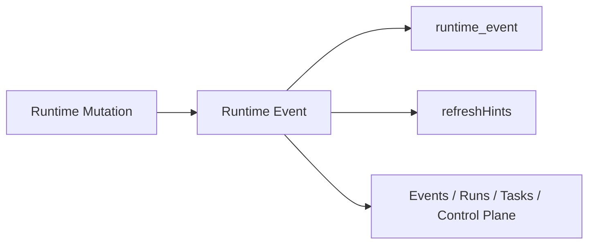

# FoxPilot 第二阶段 Runtime 事件分类体系

## 1. 文档目的

这份文档只定义一件事：

> 第二阶段 Runtime Core 应该有哪些正式事件分类，以及这些事件如何统一服务刷新、审计和页面时间线。

如果没有这份分类体系，后面会出现：

- 事件名越写越散
- 页面只能靠字符串匹配判断刷新
- `task / run / control plane` 各自一套事件风格

## 2. 分类体系定位

第二阶段事件不是日志替代品，也不是页面临时通知。

它是：

> Runtime Core 对外暴露的正式业务事件流。

## 3. 事件总链



## 4. 正式事件结构

建议第二阶段统一为：

```ts
interface RuntimeEvent {
  eventId: string
  category: RuntimeEventCategory
  type: string
  targetType: string
  targetId: string | null
  severity: 'info' | 'warning' | 'error'
  causedBy: string
  sourceCommand: string | null
  summary: string
  refreshHints: string[]
  payload: Record<string, unknown>
  occurredAt: string
}
```

## 5. 第一批事件分类

建议第二阶段第一批固定：

```text
foundation
init
task
run
handoff
execution_session
control_plane
platform
skill
mcp
```

## 6. 每类事件的职责

### 6.1 foundation

表示：

```text
基础组合安装 / 修复 / 检查
```

### 6.2 init

表示：

```text
项目扫描 / preview / apply
```

### 6.3 task

表示：

```text
任务创建、更新、推进、重分配
```

### 6.4 run

表示：

```text
阶段运行的业务状态变化
```

### 6.5 handoff

表示：

```text
阶段交接的准备、阻塞、确认和应用
```

### 6.6 execution_session

表示：

```text
平台执行过程状态变化
```

### 6.7 control_plane

表示：

```text
中控总览与注册表刷新
```

### 6.8 platform / skill / mcp

表示：

```text
单类对象的健康检查、修复、启停和状态变化
```

## 7. 第一批事件类型示例

```text
foundation.setup.started
foundation.setup.completed
foundation.repair.failed

init.preview.generated
init.apply.completed

task.created
task.advanced
task.reassigned

run.started
run.completed
run.failed

handoff.prepared
handoff.awaiting_confirmation
handoff.applied
handoff.blocked

execution_session.started
execution_session.polled
execution_session.collecting
execution_session.completed
execution_session.failed
execution_session.cancelled

platform.detect.completed
platform.doctor.completed
skill.repair.completed
mcp.restart.completed
control_plane.registry_refreshed
```

## 8. 为什么 handoff 和 execution_session 要单独成类

因为它们不等价于：

```text
run
```

它们分别表达：

- 交接行为
- 平台执行过程

如果都塞进 `run`，后面页面和审计都会失真。

## 9. 事件与 refreshHints 的关系

事件分类解决的是：

```text
发生了什么
```

`refreshHints` 解决的是：

```text
哪些页面该刷新
```

两者不能混成一层。

## 10. 第一批 refreshHints 建议

```text
dashboard
projectInit
tasks
runs
events
controlPlane
health
```

## 11. 页面如何消费

### 11.1 Events 页面

按正式事件流展示。

### 11.2 Runs / Tasks

只取与当前对象强相关的事件子集。

### 11.3 Control Plane

重点消费：

```text
control_plane
platform
skill
mcp
```

## 12. 第一批范围控制

第二阶段第一批先不做：

- 外部 webhook 事件接入
- 复杂跨项目事件订阅
- 用户自定义事件类型

先固定：

```text
内建事件分类
稳定 refreshHints
稳定页面时间线
```

## 13. 审核点

你审核这份体系时，重点看：

```text
1  是否接受 foundation / init / task / run / handoff / execution_session / control_plane / platform / skill / mcp 这十类事件
2  是否接受 handoff 和 execution_session 独立于 run
3  是否接受 refreshHints 只做刷新，不替代事件分类
4  是否接受 Events 页面消费正式事件流，而不是页面自拼日志
```
