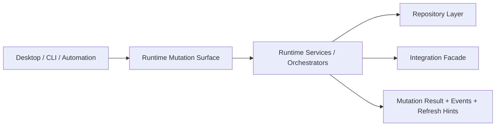

# FoxPilot 第二阶段 Runtime 变更面

## 1. 文档目的

这份文档只定义一件事：

> 第二阶段 `Runtime Core` 应该暴露哪些正式写能力，以及这些写能力如何稳定服务 Desktop、CLI 和后续自动化。

前面已经有：

- Runtime 命令模型
- Runtime 查询面
- Desktop Bridge 契约
- 页面动作协议

这份文档继续把“写能力”收成统一变更面，避免后面：

- 页面自己拼命令
- CLI 和 Desktop 各自定义一套写接口
- 事件、刷新、确认策略四处散落

## 2. 变更面定位

第二阶段的变更面不是：

- Repository 的原始写方法
- 页面按钮的点击逻辑
- CLI 命令字符串本身

它是：

> Runtime Core 对上层暴露的正式副作用能力集合

也就是：

```text
Desktop Bridge 调的是变更面
CLI --json 也应该尽量映射到变更面
Automation 以后也应复用这层
```

## 3. 总链



## 4. 第一批变更面分组

建议第二阶段第一批固定为：

```text
foundation.*
init.*
task.*
run.*
platform.*
skill.*
mcp.*
```

## 5. 变更结果总结构

建议所有写操作统一返回：

```ts
interface RuntimeMutationResult<T = Record<string, unknown>> {
  command: string
  status: 'applied' | 'previewed' | 'confirmation_required' | 'rejected' | 'failed'
  summary: string
  data: T | null
  warnings: string[]
  emittedEvents: RuntimeEventSummary[]
  refreshHints: string[]
  confirmation: ConfirmationRequirement | null
}
```

## 6. 为什么必须统一结果结构

如果不同命令各自返回不同风格：

- Desktop 很难统一处理成功态和失败态
- CLI `--json` 很难稳定
- 自动化以后没法只靠一层契约消费

所以第二阶段必须固定：

```text
写操作一定返回：
状态
摘要
事件
刷新提示
确认要求
```

## 7. 第一批变更面建议

### 7.1 Foundation

```text
foundation.setup
foundation.repair
```

用途：

- 安装阶段基础组合接管
- Settings / Health 页面修复动作

### 7.2 Init

```text
init.preview
init.apply
```

用途：

- Project Init Wizard 预览
- Project Init Wizard 正式接管

### 7.3 Task

```text
task.create
task.patch
task.advance
task.reassign
```

用途：

- 任务创建
- 任务字段更新
- 阶段推进
- 角色 / 平台重分配

### 7.4 Run

```text
run.start
run.complete
run.fail
run.cancel
```

用途：

- 运行生命周期推进
- 运行结果回写

### 7.5 Platform

```text
platform.detect
platform.doctor
```

说明：

虽然这类动作看起来更像“检查”，但它们会：

- 更新平台快照
- 产生事件
- 影响读模型

所以应进入正式变更面，而不是只算查询。

### 7.6 Skill

```text
skill.repair
skill.enable
skill.disable
skill.install
skill.uninstall
```

### 7.7 MCP

```text
mcp.repair
mcp.restart
mcp.enable
mcp.disable
mcp.add
mcp.remove
```

## 8. 预览与正式提交

第二阶段里，凡是可能：

- 改项目配置
- 改全局配置
- 改注册表
- 改系统环境

的动作，都应优先支持：

```text
preview
apply
```

最典型的是：

```text
init.preview -> init.apply
```

后面 Foundation 和批量 Control Plane 动作也可以沿用这套模式。

## 9. 变更面与确认策略的关系

变更面不自己定义确认文案，但必须为每个命令声明：

```text
riskLevel
confirmationLevel
supportsDryRun
```

真正的确认规则由：

```text
风险确认策略
```

统一收口。

## 10. 变更面与交接模型的关系

第二阶段已经明确：

```text
阶段 != 角色 != 平台
```

所以以下动作不只是简单写字段：

```text
task.advance
task.reassign
run.complete
run.fail
```

它们都可能触发：

- 阶段切换
- 角色切换
- 平台切换
- handoff 记录生成

也就是：

```text
写操作 -> handoff 计算 -> 事件 -> 刷新
```

## 11. Desktop / CLI 的使用规则

### 11.1 Desktop

Desktop 不直接写 SQLite，也不直接调外部工具。

它只能：

```text
页面动作
-> Desktop Bridge
-> Runtime Mutation Surface
```

### 11.2 CLI

CLI 保留人和脚本的入口价值，但第二阶段要尽量：

```text
CLI 命令
-> Runtime Mutation Surface
-> 统一结果结构
```

## 12. 第一批范围建议

第二阶段第一批建议优先做：

```text
init.preview / init.apply
platform.detect / platform.doctor
skill.repair
mcp.repair / mcp.restart
task.advance
run.complete / run.fail
```

这样可以先把：

- 初始化写链
- 中控检查写链
- 运行到下一阶段的推进写链

三条主链打通。

## 13. 审核点

你审核这份文档时，重点看：

```text
1  是否接受 Runtime Mutation Surface 成为正式写接口层
2  是否接受 detect / doctor 这类“会刷新快照”的动作也进入变更面
3  是否接受所有写操作都统一返回 事件 + 刷新提示 + 确认要求
4  是否接受 init / task / run / control plane 写链共用同一套结果结构
```
