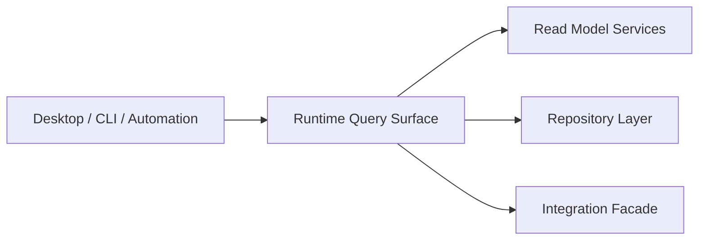

# FoxPilot 第二阶段 Runtime 查询面

## 1. 文档目的

这份文档只定义一件事：

> 第二阶段 `Runtime Core` 应该暴露哪些查询面，来稳定支撑 Desktop、CLI 和后续自动化消费。

前面已经有：

- Runtime 命令模型
- Desktop Bridge 契约
- 桌面读模型契约
- 页面级数据契约

这份文档继续把“读能力”收成统一查询面，避免后面每个页面都各找各的 Service。

## 2. 查询面定位

第二阶段的查询面不是：

- Repository 的原始查询
- CLI `--json` 的命令名列表
- 页面本地缓存结构

它是：

> Runtime Core 对上层暴露的正式读能力集合

也就是：

```text
Desktop Bridge 调的是查询面
CLI --json 也应该尽量映射到查询面
后续自动化和脚本也能复用这层
```

## 3. 查询面总图



## 4. 第一批查询面分组

建议第二阶段第一批固定为：

```text
dashboard.*
project.*
task.*
run.*
event.*
health.*
controlPlane.*
init.*
```

## 5. Dashboard 查询面

### 5.1 命令

```text
dashboard.overview
```

### 5.2 返回

```text
DashboardReadModel
```

### 5.3 用途

- Dashboard 首页
- 桌面端总览卡片

## 6. Project 查询面

### 6.1 命令

```text
project.list
project.show
project.repositories
```

### 6.2 返回

```text
ProjectListReadModel
ProjectDetailReadModel
RepositoryListReadModel
```

### 6.3 用途

- Projects 页面
- Init Wizard 的项目信息摘要

## 7. Task 查询面

### 7.1 命令

```text
task.list
task.show
task.history
task.filters
```

### 7.2 返回

```text
TaskListReadModel
TaskDetailReadModel
TaskHistoryReadModel
TaskFilterOptionsReadModel
```

### 7.3 用途

- Tasks 页面
- Dashboard 任务跳转
- 右侧任务面板

## 8. Run 查询面

### 8.1 命令

```text
run.show
run.byTask
```

### 8.2 返回

```text
RunDetailReadModel
RunSummaryReadModel[]
```

### 8.3 用途

- Runs 页面
- Tasks 侧栏最近运行

## 9. Event 查询面

### 9.1 命令

```text
event.list
event.byTarget
```

### 9.2 返回

```text
EventTimelineReadModel
EventSummaryReadModel[]
```

### 9.3 用途

- Events 页面
- Task / Run / Control Plane 关联跳转

## 10. Health 查询面

### 10.1 命令

```text
health.summary
foundation.inspect
foundation.doctor
install.info
```

### 10.2 返回

```text
HealthReadModel
FoundationReadModel
InstallInfoReadModel
```

### 10.3 用途

- Settings / Health 页面
- Dashboard 告警摘要

## 11. Control Plane 查询面

### 11.1 命令

```text
controlPlane.overview
platform.list
platform.inspect
platform.capabilities
platform.resolve

skill.list
skill.inspect

mcp.list
mcp.inspect
```

### 11.2 返回

```text
ControlPlaneOverviewReadModel
PlatformListReadModel
PlatformDetailReadModel
SkillListReadModel
SkillDetailReadModel
MCPListReadModel
MCPDetailReadModel
```

### 11.3 用途

- Control Plane 首页
- Platforms / Skills / MCP 页面

## 12. Init 查询面

### 12.1 命令

```text
init.scan
init.preview
```

### 12.2 返回

```text
InitWizardReadModel
ProjectOrchestrationSnapshot
```

### 12.3 用途

- Project Init Wizard

## 13. 查询面与命令模型的关系

查询面不是新的命令体系，而是 `Runtime 命令模型` 中 `query` 类命令的稳定视图。

也就是：

```text
task.list
task.show
platform.list
controlPlane.overview
```

这些命令，本质上就是查询面的一部分。

## 14. 为什么要单独定义查询面

因为如果只有：

```text
Runtime 命令模型
```

实现时很容易退化成：

- 页面直接找某个 service
- CLI 直接拼某个 repository
- Dashboard 自己再聚合一遍

有了查询面之后，规则会更清楚：

```text
读操作 先走 Query Surface
写操作 再走 Mutation / Health / Repair
```

## 15. 审核点

你审核这份查询面时，重点看：

```text
1  是否接受 Runtime Core 正式暴露 Query Surface
2  是否接受每个主要页面都映射到一组稳定查询命令
3  是否接受 controlPlane.overview 归入查询面，而不是页面私有聚合
4  是否接受 init.scan / init.preview 也属于查询面的一部分
```
