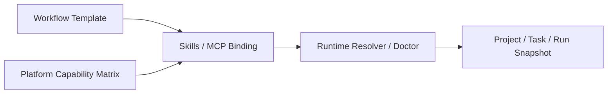

# FoxPilot 第二阶段 Skills / MCP 绑定模型

## 1. 文档目的

这份文档只定义一件事：

> 第二阶段如何把 Skills / MCP 从“全局清单”提升为“与阶段、角色、平台、模板相关的正式依赖”。

如果没有绑定模型，后面会出现：

- Skills / MCP 页能看到很多对象
- 但系统不知道哪个任务真正依赖它们
- 平台解析结果和中控页也说不清哪些能力是必须的

## 2. 模型定位

Skills / MCP 绑定模型不是：

- Skills / MCP 的安装清单
- Platforms 页的能力画像
- Task 的当前状态

它是：

> Runtime Core 用来判断“某个阶段 / 角色 / 平台 / 模板依赖哪些 skill 和 mcp”的正式依赖层

## 3. 绑定总链



## 4. 绑定必须回答的问题

每条绑定至少要回答：

```text
绑定到谁
依赖的是 skill 还是 mcp
是必须、推荐还是可选
缺失时会不会阻塞
是否允许自动修复或建议安装
```

## 5. 正式绑定结构

建议第二阶段统一为：

```ts
interface CapabilityBinding {
  bindingId: string
  scope: BindingScope
  targetId: string
  dependencyType: 'skill' | 'mcp'
  dependencyId: string
  requirement: 'required' | 'recommended' | 'optional' | 'blocked'
  enableMode: 'auto' | 'suggest' | 'manual'
  healthImpact: 'block' | 'degrade' | 'none'
  reasons: string[]
}
```

其中：

```ts
type BindingScope = 'workflow' | 'stage' | 'role' | 'platform' | 'project'
```

## 6. 为什么需要多层 scope

因为依赖关系不是都长在同一层：

### 6.1 workflow

回答：

```text
这一整类工作流通常依赖什么
```

### 6.2 stage

回答：

```text
某个阶段必需什么
```

### 6.3 role

回答：

```text
某个角色更适合什么
```

### 6.4 platform

回答：

```text
某个平台接手时需要什么
```

### 6.5 project

回答：

```text
这个具体项目做了什么显式绑定
```

## 7. requirement 含义

### 7.1 required

缺失时：

```text
会阻塞当前阶段或显著影响平台选择
```

### 7.2 recommended

缺失时：

```text
不阻塞，但系统应明确提示能力下降
```

### 7.3 optional

缺失时：

```text
只影响体验，不影响主流程
```

### 7.4 blocked

含义：

```text
这个目标不应与该依赖组合共存
```

## 8. enableMode 含义

### 8.1 auto

适用：

```text
系统允许自动启用或自动修复
```

### 8.2 suggest

适用：

```text
系统给建议，但不自动改
```

### 8.3 manual

适用：

```text
只能人工处理
```

## 9. 第一批绑定示例

### 9.1 design 阶段

```text
scope         stage
targetId      design
dependency    skill: architecture-designer
requirement   recommended
healthImpact  degrade
```

### 9.2 verify 阶段

```text
scope         stage
targetId      verify
dependency    mcp: github
requirement   recommended
healthImpact  degrade
```

### 9.3 docs-heavy 模板

```text
scope         workflow
targetId      docs-heavy
dependency    skill: doc-coauthoring
requirement   recommended
healthImpact  degrade
```

### 9.4 某平台专属依赖

```text
scope         platform
targetId      qoder
dependency    skill: systematic-debugging
requirement   optional
healthImpact  none
```

## 10. 绑定如何参与 Runtime 决策

第二阶段建议固定：

### 10.1 Init Preview

用于提示：

```text
当前项目选这套模板 / 阶段链后
缺哪些 skill / mcp
哪些会阻塞
哪些只是建议补齐
```

### 10.2 Platform Resolve

用于评分：

```text
如果某平台关键依赖缺失
则降低评分或直接阻塞
```

### 10.3 Doctor / Repair

用于解释：

```text
为什么某个阶段现在不可用
为什么中控页提示 degraded
```

## 11. Desktop 里怎么呈现

第二阶段桌面端不应只在 Skills / MCP 页里显示“对象列表”，还应能展示：

```text
哪些工作流依赖它
哪些阶段依赖它
缺失时影响什么
当前是 required 还是 recommended
```

## 12. 第一批范围控制

第二阶段第一批先不做：

- 自动学习绑定关系
- 跨项目共享绑定推荐
- 复杂冲突求解器

先固定：

```text
显式绑定模型
稳定 doctor 解释
稳定 UI 呈现
```

## 13. 审核点

你审核这份模型时，重点看：

```text
1  是否接受 Skills / MCP 绑定成为 Runtime 正式依赖层
2  是否接受 workflow / stage / role / platform / project 五层 scope
3  是否接受 requirement + enableMode + healthImpact 这三个核心维度
4  是否接受 Skills / MCP 页面需要展示“被谁依赖”，而不只是自身状态
```
