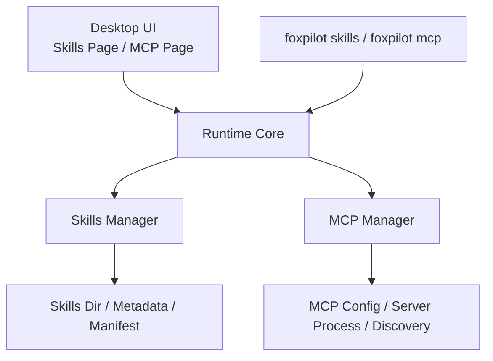

# FoxPilot 第二阶段 Skills / MCP 管理模型

## 1. 文档目的

这份文档只定义：

> 第二阶段里，`Skills` 和 `MCP` 在 FoxPilot 里应该如何被管理。

它不讨论具体页面视觉，也不讨论某个技能细节。  
它只固定：

- `Skills / MCP` 属于哪一层
- `Desktop / CLI / Runtime` 各自负责什么
- 状态模型和管理动作有哪些

## 2. 正式定位

第二阶段里：

```text
Skills / MCP
不属于 UI 层
不属于 CLI 入口层
属于协作集成层
```

更准确地说：

- UI 只提供管理界面
- CLI 只提供管理命令
- Runtime Core 统一编排
- `Skills Manager / MCP Manager` 负责真正接入和管理

## 3. 总体架构



## 4. Skills 管理模型

### 4.1 Skills 的对象定义

第二阶段里，每个 skill 至少有这些核心信息：

```text
skillId
name
source
version
status
installPath
manifestPath
lastCheckedAt
```

### 4.2 Skills 状态

建议统一为：

```text
installed
disabled
broken
missing
updatable
```

说明：

- `installed`：已安装且可用
- `disabled`：已安装但被禁用
- `broken`：目录存在但元数据或文件不完整
- `missing`：配置里声明存在，但实际未检测到
- `updatable`：已安装但可升级

### 4.3 Skills 管理动作

第二阶段第一批建议支持：

```text
list
inspect
install
uninstall
enable
disable
doctor
repair
```

### 4.4 Skills Manager 职责

负责：

- 扫描技能目录
- 读取元数据
- 检查 `SKILL.md` / manifest / 依赖完整性
- 执行安装与卸载
- 执行启用与禁用
- 产出 doctor / repair 结果

不负责：

- 任务状态推进
- UI 状态管理

## 5. MCP 管理模型

### 5.1 MCP 的对象定义

第二阶段里，每个 MCP server 至少有这些核心信息：

```text
serverId
name
source
status
configPath
command
args
envSummary
lastCheckedAt
```

### 5.2 MCP 状态

建议统一为：

```text
configured
running
stopped
broken
missing
degraded
```

### 5.3 MCP 管理动作

第二阶段第一批建议支持：

```text
list
inspect
add
remove
enable
disable
doctor
repair
restart
```

### 5.4 MCP Manager 职责

负责：

- 读取 MCP 配置
- 发现 MCP server
- 检查命令可用性
- 检查进程和配置状态
- 启停与重启
- doctor / repair

不负责：

- 业务编排决策
- 页面状态缓存

## 6. Desktop 里的呈现方式

### 6.1 Skills 页面

建议至少展示：

```text
名称
来源
版本
状态
安装路径
最近检查时间
可执行动作
```

可执行动作建议放在右侧面板或行操作区：

```text
查看详情
启用 / 禁用
卸载
doctor
repair
```

### 6.2 MCP 页面

建议至少展示：

```text
名称
状态
配置来源
命令
最近检查时间
可执行动作
```

可执行动作建议：

```text
查看详情
启用 / 禁用
重启
doctor
repair
删除
```

## 7. CLI 里的承接方式

第二阶段 CLI 应补成：

```text
foxpilot skills ...
foxpilot mcp ...
```

但 CLI 只是入口。

这些命令最终仍然必须走：

```text
CLI Adapter
-> Runtime Core
-> Skills Manager / MCP Manager
```

不允许 CLI 自己绕过 Runtime Core 直接改目录或配置。

## 8. 配置与存储边界

### 8.1 Skills

Skills 的真实来源一般是：

- 技能目录
- 技能元数据文件
- 安装记录

这类对象建议：

- 元数据以目录和 manifest 为真
- Runtime 再聚合成读模型
- SQLite 可存摘要快照，但不应成为唯一真相源

### 8.2 MCP

MCP 的真实来源一般是：

- MCP 配置文件
- 进程状态
- 检查结果

建议：

- 配置文件为真
- Runtime 聚合进程状态和 doctor 状态
- SQLite 存历史或摘要，不替代配置文件

## 9. 错误与健康模型

Skills 和 MCP 都应统一返回：

```text
ready
degraded
unavailable
```

并统一错误码风格，例如：

```text
CONFIG_NOT_FOUND
MANIFEST_INVALID
COMMAND_NOT_FOUND
PERMISSION_DENIED
PROCESS_START_FAILED
STATE_INVALID
```

这样 Desktop 和 CLI 才能共用健康展示逻辑。

## 10. 第二阶段第一批优先级

建议顺序：

```text
1  Skills list / inspect / doctor
2  MCP list / inspect / doctor
3  Skills enable / disable / repair
4  MCP enable / disable / restart / repair
5  Skills install / uninstall
6  MCP add / remove
```

这样先把可见性和可诊断性做起来，再补更多写操作。

## 11. 审核点

你审核这份模型时，重点看：

```text
1  是否接受 Skills / MCP 进入协作集成层
2  是否接受 Desktop 只做管理界面，不直接碰目录和配置
3  是否接受 CLI 只做入口，不直接越过 Runtime Core
4  是否接受 Skills / MCP 都先以“状态管理 + doctor / repair”为第一批重点
```
