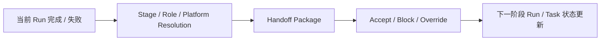

# FoxPilot 第二阶段阶段 / 角色 / 平台交接模型

## 1. 文档目的

这份文档只定义一件事：

> 当任务从一个阶段推进到下一个阶段时，FoxPilot 如何完成阶段、角色、平台之间的正式交接。

如果没有这层模型，后面会出现：

- `design -> implement` 只是改一个字段
- 平台切换没有上下文包
- `Run` 完成后，下一步为什么分给另一个平台说不清

## 2. 模型定位

第二阶段已经明确：

```text
阶段 != 角色 != 平台
```

所以任务推进不应理解成：

```text
status 变一下就结束
```

而应理解成：

```text
一个阶段完成
-> 形成交接包
-> 解析下一阶段的角色和平台
-> 创建下一阶段接手上下文
```

## 3. 交接总链



## 4. 第一批交接触发点

建议第二阶段第一批至少覆盖：

```text
run.complete
run.fail
task.advance
task.reassign
```

这些动作一旦发生，就应检查是否需要交接。

## 5. 交接触发类型

建议先固定为：

```text
stage_completed
stage_failed
manual_advance
manual_reassign
system_repair
```

## 6. 交接对象

建议第二阶段统一抽成：

```ts
interface StageHandoff {
  handoffId: string
  taskId: string
  trigger: HandoffTrigger
  from: HandoffEndpoint
  to: HandoffEndpoint
  status: HandoffStatus
  summary: string
  artifacts: HandoffArtifact[]
  risks: string[]
  createdAt: string
}
```

其中：

```ts
interface HandoffEndpoint {
  stage: StageId | null
  role: RoleId | null
  platform: PlatformId | 'manual' | null
  runId: string | null
}
```

## 7. 交接状态

建议第一版固定：

```text
prepared
awaiting_confirmation
accepted
blocked
cancelled
applied
```

含义：

- `prepared`：已生成交接包
- `awaiting_confirmation`：需要人工确认
- `accepted`：已接受交接方案
- `blocked`：有阻塞项，不能推进
- `cancelled`：交接被取消
- `applied`：已落成下一阶段生效结果

## 8. 交接包内容

第二阶段不应只交一个“摘要字符串”，而应至少带：

```ts
interface HandoffArtifact {
  type:
    | 'design_brief'
    | 'implementation_plan'
    | 'code_change_summary'
    | 'test_report'
    | 'review_findings'
    | 'repair_note'
    | 'context_snapshot'
  label: string
  value: string
}
```

## 9. 为什么需要交接包

因为后面你已经明确会出现这种情况：

```text
design     -> codex
implement  -> claude_code
verify     -> qoder
repair     -> trae
```

如果平台切了，但没有正式交接包，下一平台只能重新猜上下文。

## 10. 交接解析规则

建议第二阶段固定：

### 10.1 先定下一阶段

由 `Stage Orchestrator` 决定：

```text
当前阶段之后应该进入哪个阶段
```

### 10.2 再定角色

由 `Role Orchestrator` 决定：

```text
下一阶段对应哪个角色
```

### 10.3 再定平台

由 `Platform Resolver` 决定：

```text
下一阶段 / 角色最终交给哪个平台
```

### 10.4 最后生成交接包

由 `Handoff Service` 统一生成：

```text
from
to
artifacts
risks
summary
```

## 11. 第一批默认交接链

建议第二阶段第一批固定默认链为：

```text
analysis   -> design
design     -> implement
implement  -> verify
verify     -> review
verify     -> repair   （失败时）
repair     -> verify
review     -> done
```

## 12. 第一批默认角色映射

建议第一版沿用：

```text
analysis   -> analyst
design     -> designer
implement  -> coder
verify     -> tester
repair     -> fixer
review     -> reviewer
```

## 13. 典型交接示例

### 13.1 设计交给编码

```text
from
design / designer / codex

to
implement / coder / claude_code
```

交接包至少包含：

- 设计摘要
- 约束条件
- 目标文件范围
- 不可突破的边界

### 13.2 验证失败转修复

```text
from
verify / tester / qoder

to
repair / fixer / trae
```

交接包至少包含：

- 失败用例
- 错误摘要
- 最小修复方向

## 14. 与 Task / Run / Event 的关系

### 14.1 Task

Task 记录的是：

```text
当前所处阶段
当前角色
当前生效平台
```

### 14.2 Run

Run 记录的是：

```text
某一阶段的一次执行
```

### 14.3 Handoff

Handoff 记录的是：

```text
当前 Run 如何正式交给下一阶段
```

### 14.4 Event

Event 记录的是：

```text
交接什么时候发生
是否成功
为什么被阻塞
```

## 15. 什么时候必须人工确认

建议以下场景必须进入：

```text
awaiting_confirmation
```

例如：

- 平台从推荐值切到用户覆盖值
- 下一阶段需要新的高风险能力
- 交接包有阻塞项
- 用户手动改阶段或改平台

## 16. 第一批范围控制

第二阶段第一批先不做：

- 并行多分支交接
- 多平台同时接手同一阶段
- 复杂回退图
- 跨项目交接

先只做：

```text
单任务
单主链
单下一阶段
```

## 17. 审核点

你审核这份模型时，重点看：

```text
1  是否接受阶段推进必须生成正式 handoff，而不是只改字段
2  是否接受 handoff 成为 Task / Run / Event 之间的独立对象
3  是否接受 design -> implement -> verify -> repair / review 这条默认链
4  是否接受平台切换时必须交付 artifacts，而不是只给最终平台值
```
