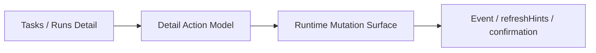

# FoxPilot 第二阶段 Tasks / Runs 详情动作模型

## 1. 文档目的

这份文档只定义一件事：

> 第二阶段 Tasks 详情和 Runs 详情页到底允许触发哪些动作，以及这些动作如何和 handoff、session、确认策略对齐。

如果没有这层模型，后面会出现：

- 详情页想加什么按钮就加什么按钮
- Tasks 和 Runs 对同一件事给出两套动作
- 平台执行、阶段推进、交接确认散在不同页面

## 2. 模型定位

详情动作模型不是：

- 页面按钮排版稿
- CLI 子命令列表
- Control Plane 动作矩阵的替代品

它是：

> 任务与运行详情页在第二阶段允许发起的正式动作边界。

## 3. 总链



## 4. 为什么详情页必须单独建模

因为详情页和列表页的职责不同：

- 列表页负责扫描和筛选
- 详情页负责解释和推进

所以详情页必须明确：

```text
哪些动作可以直接做
哪些动作只能查看
哪些动作必须先确认
```

## 5. Tasks 详情页第一批动作

建议第二阶段第一批固定：

```text
查看任务详情
查看任务历史
查看最近运行
阶段推进（advance）
角色 / 平台重分配（reassign）
打开 handoff 详情
跳转 Control Plane 关联对象
```

## 6. Runs 详情页第一批动作

建议第二阶段第一批固定：

```text
查看 run 详情
查看 execution session 状态
查看产物与测试结果
查看 handoff 准备结果
取消当前运行
重试推荐
跳转关联 task / platform
```

## 7. 详情动作为什么不能无上限

如果详情页既能：

- 装 skill
- 改 mcp
- 改全局配置

又能：

- 推阶段
- 改平台

那页面边界会彻底混乱。

所以第二阶段必须固定：

```text
Task / Run 详情页
只负责与当前 task / run 强相关的动作
```

## 8. Task Detail 动作分层

### 8.1 只读动作

```text
task.show
task.history
run.byTask
event.byTarget
```

### 8.2 轻推进动作

```text
task.advance
```

### 8.3 强变更动作

```text
task.reassign
```

### 8.4 跳转动作

```text
跳转 run
跳转 platform
跳转 handoff
```

## 9. Run Detail 动作分层

### 9.1 只读动作

```text
run.show
event.byTarget
```

### 9.2 会话动作

```text
run.cancel
```

### 9.3 后续动作

```text
查看 handoff
进入下一阶段上下文
跳转关联 task / platform
```

## 10. 与 Execution Session 的关系

Run Detail 不能只显示业务状态。

它还必须承接：

```text
当前 session 状态
externalRunId
最近轮询时间
collecting 状态
终态结果
```

所以 Run Detail 的动作也必须围绕 `Execution Session` 建模。

## 11. 与 Handoff 的关系

Task Detail 和 Run Detail 都必须能解释：

```text
当前阶段交给了谁
下一阶段准备交给谁
交接包里有哪些 artifacts
是否在等待确认
```

第二阶段不一定要把 handoff 做成完整独立页面，但至少要有：

```text
可展开详情块
```

## 12. 确认级别建议

### 12.1 task.advance

```text
soft
```

### 12.2 task.reassign

```text
hard
```

### 12.3 run.cancel

```text
hard
```

## 13. 第一批范围控制

第二阶段第一批先不做：

- 详情页内直接安装 / 卸载 skill
- 详情页内直接新增 / 删除 mcp
- 详情页内复杂批量操作

这些仍应回到：

```text
Control Plane / Settings / Health
```

## 14. 审核点

你审核这份模型时，重点看：

```text
1  是否接受 Task / Run 详情页只承接强相关动作
2  是否接受 task.advance / task.reassign / run.cancel 作为第一批正式详情动作
3  是否接受 Run Detail 必须把 Execution Session 一起建模
4  是否接受 handoff 至少要有详情块而不是只有一个状态字段
```
