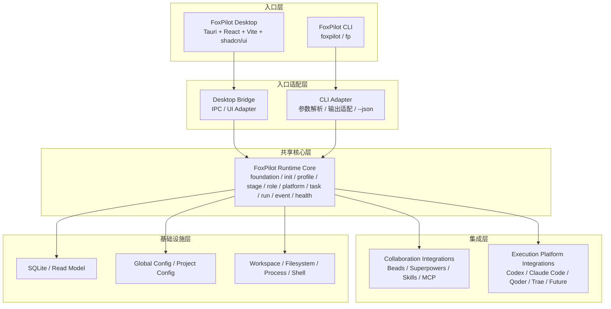

# FoxPilot 第二阶段工具整体架构图

## 1. 文档目的

这份文档只回答一个问题：

> FoxPilot 第二阶段作为一个完整工具，整体分几层，每层边界是什么。

它不展开页面细节，也不展开命令参数细节。  
它只固定三件事：

- `Desktop` 和 `CLI` 必须是两个独立入口
- `Runtime Core` 必须是唯一业务核心
- 后续 `Codex / Claude Code / Qoder / Trae` 等平台扩展，不能推翻主架构

配套子文档：

- `foxpilot-phase2-runtime-core-architecture.md`
- `foxpilot-phase2-integrations-architecture.md`
- `foxpilot-phase2-desktop-module-diagram.md`
- `foxpilot-phase2-cli-json-contract.md`

## 2. 正式架构结论

第二阶段正式架构固定为：

```text
Desktop 入口
CLI 入口
-> 共用 Runtime Core
-> Runtime Core 再统一管理集成层和基础设施层
```

这意味着：

- 桌面端不是 CLI 的简单壳
- CLI 不是桌面端的内部实现细节
- `Runtime Core` 才是系统真正核心
- `Skills / MCP` 必须进入正式集成层
- 执行平台必须抽象成平台层，而不是写死成 `Codex`

## 3. 整体分层架构图



## 4. 各层职责

### 4.1 入口层

入口层只有两个：

- `FoxPilot Desktop`
- `FoxPilot CLI`

这一层负责：

- 提供不同交互入口
- 区分桌面交互和脚本化交互
- 把输入转交给下一层

这一层不负责：

- 业务规则
- 状态流转
- 外部工具调用
- 数据读写决策

### 4.2 入口适配层

入口适配层负责把不同入口翻译成统一 Runtime 命令。

包含：

- `Desktop Bridge`
- `CLI Adapter`

这一层负责：

- 桌面端 IPC/桥接
- CLI 参数解析与命令分发
- 把返回结果适配成 UI 状态或终端输出
- 提供 `--json` 这种脚本化接口

这一层不负责：

- 决定任务如何流转
- 决定使用哪个平台
- 直接写 SQLite

### 4.3 共享核心层

共享核心层就是：

> `FoxPilot Runtime Core`

这一层负责：

- Foundation Pack
- 项目初始化
- 项目协作 profile
- 阶段编排
- 角色编排
- 平台解析
- 任务 / 运行 / 事件
- 健康检查与修复建议

这是第二阶段唯一业务核心。

### 4.4 集成层

集成层分成两组：

#### 协作集成层

- `Beads`
- `Superpowers`
- `Skills`
- `MCP`

#### 执行平台集成层

- `Codex`
- `Claude Code`
- `Qoder`
- `Trae`
- 后续平台

这一层只负责：

- 接入外部能力
- 返回能力探测和执行结果
- 统一外部错误模型

这一层不负责：

- 任务状态流转
- 平台选择规则
- 页面交互

### 4.5 基础设施层

基础设施层负责：

- SQLite
- 全局配置
- 项目配置
- 工作区文件
- 文件系统
- 进程与 shell

这一层只负责“落地”和“系统能力”，不负责业务规则。

## 5. 最关键的抽象：阶段 / 角色 / 平台

第二阶段必须明确：

```text
阶段 != 角色 != 平台
```

### 5.1 阶段

例如：

- `analysis`
- `design`
- `implement`
- `verify`
- `repair`
- `review`

### 5.2 角色

例如：

- `designer`
- `coder`
- `tester`
- `reviewer`
- `fixer`

### 5.3 平台

例如：

- `codex`
- `claude_code`
- `qoder`
- `trae`

### 5.4 为什么必须分开

因为未来很可能出现：

```text
design     -> codex
implement  -> claude_code
verify     -> qoder
repair     -> trae
```

如果现在把“平台”直接等于“执行器”或“角色”，后面一定返工。

## 6. 固定调用方向

允许的调用方向只有：

```text
Desktop -> Desktop Bridge -> Runtime Core
CLI -> CLI Adapter -> Runtime Core
Runtime Core -> Integrations
Runtime Core -> Infra
```

不允许：

```text
Desktop -> 直接写 SQLite
Desktop -> 直接调 Beads / Skills / MCP
CLI -> 绕过 Runtime Core 自己做业务决策
集成层 -> 直接改 task / run / event 状态
```

## 7. CLI 在第二阶段的正式定位

CLI 在第二阶段仍然是正式入口，但它的定位要重新固定：

- 命令行入口
- 自动化入口
- 脚本化入口
- 调试入口

`CLI --json` 保留，但它的定位是：

```text
脚本化接口
自动化接口
调试接口
```

不是桌面端的唯一主通道，也不是 Runtime Core 的替代品。

## 8. Desktop 在第二阶段的正式定位

Desktop 的正式定位是：

> 本地协作控制台

它承接：

- Dashboard
- 项目 / 仓库视图
- 任务中心
- 运行详情
- 事件时间线
- 设置与健康页
- `Skills` 管理页
- `MCP` 管理页

它不承接：

- 直接业务规则实现
- 直接外部工具操作
- 直接数据写入逻辑

## 9. 过渡方案说明

此前的“桌面端直接调用 CLI”方案，只能保留为过渡实现参考。

它的意义是：

- 先复用第一阶段 CLI 做早期桌面验证
- 为 `--json` 和结构化读模型提供过渡通道

但它不是第二阶段最终架构。

第二阶段最终架构必须是：

```text
Desktop / CLI 双入口
+ Shared Runtime Core
+ 集成层
+ 基础设施层
```

## 10. 审核点

你审核这份文档时，重点看 4 件事：

```text
1  是否接受 Desktop / CLI 双入口
2  是否接受 Runtime Core 作为唯一业务核心
3  是否接受协作集成层和执行平台集成层分开
4  是否接受“阶段 / 角色 / 平台”三层抽象
```

## 11. 当前结论

第二阶段整体工具架构已经收口为：

- `Tauri + React + Vite + shadcn/ui` 的桌面端
- `foxpilot / fp` 的 CLI 端
- 共享 `Runtime Core`
- 协作集成层
- 执行平台集成层
- 基础设施层

这套结构能同时支撑：

- 第一阶段 CLI 能力承接
- 第二阶段桌面控制台
- 后续 `Codex / Claude Code / Qoder / Trae` 等平台扩展
