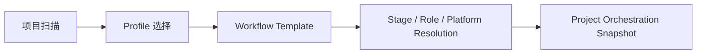

# FoxPilot 第二阶段工作流模板模型

## 1. 文档目的

这份文档只定义一件事：

> 第二阶段如何把不同项目类型的编排主线收成可复用的工作流模板，而不是每个项目都从零拼阶段链。

如果没有模板层，后面会出现：

- 每个项目都要重新决定阶段顺序
- `init.preview` 很难给出稳定建议
- 阶段推进与 handoff 只能写死在代码里

## 2. 模型定位

工作流模板不是：

- Profile
- Platform Resolver
- 项目级最终快照

它是：

> 在 Profile 之上、项目快照之前的一层编排骨架

也就是：

```text
Profile 决定协作强度
Workflow Template 决定阶段主链
Resolver 决定每个阶段交给谁
```

## 3. 总链



## 4. 模板必须回答的问题

每个工作流模板至少要回答：

```text
有哪些阶段
阶段顺序是什么
哪些阶段可选
成功后去哪
失败后去哪
每个阶段需要什么能力
每个阶段建议什么平台类型
```

## 5. 正式模板结构

建议第二阶段统一为：

```ts
interface WorkflowTemplate {
  templateId: string
  name: string
  description: string
  matchRules: WorkflowMatchRule[]
  profileScope: ProfileId[]
  stages: WorkflowStageTemplate[]
}
```

其中每个阶段：

```ts
interface WorkflowStageTemplate {
  stage: StageId
  role: RoleId
  optional: boolean
  successNext: StageId | 'done'
  failureNext: StageId | 'blocked'
  requiredCapabilities: string[]
  preferredPlatforms: PlatformId[]
  requiredBindings: BindingRef[]
}
```

## 6. 为什么模板不能和 Profile 混在一起

因为这两层回答的问题不同：

### 6.1 Profile

回答：

```text
这个项目要不要启用完整协作能力
```

### 6.2 Workflow Template

回答：

```text
这个项目的阶段主链应该长什么样
```

如果把两者混成一层，后面：

- 项目类型扩展很难做
- UI 文案会混乱
- 阶段推进难以复用

## 7. 第一批模板建议

### 7.1 standard-software

适用：

- 标准代码仓库
- 需要分析、设计、实现、验证、修复、评审

主链：

```text
analysis -> design -> implement -> verify -> review -> done
verify failed -> repair -> verify
```

### 7.2 fast-bugfix

适用：

- 小范围 bugfix
- 更短编排链

主链：

```text
analysis -> implement -> verify -> done
verify failed -> repair -> verify
```

### 7.3 docs-heavy

适用：

- 文档、规范、方案类项目

主链：

```text
analysis -> design -> review -> done
```

## 8. 模板匹配规则

建议第一版根据以下信号匹配：

```text
projectType
repositoryLayout
workspaceSignals
selectedProfile
```

例如：

- `package.json + tests` 更倾向 `standard-software`
- 单文档型仓库更倾向 `docs-heavy`
- 用户明确指定 bugfix 模式则更倾向 `fast-bugfix`

## 9. 模板与 handoff 的关系

模板不只决定阶段顺序，还决定：

```text
每个阶段交接时需要什么 artifacts
```

例如：

- `design -> implement` 要求 `design_brief`
- `implement -> verify` 要求 `code_change_summary`
- `verify -> repair` 要求 `test_report`

## 10. 模板与平台解析的关系

模板不直接拍板最终平台，但会提供：

```text
preferredPlatforms
requiredCapabilities
```

这些会进入 `Platform Resolver` 的评分依据。

## 11. 模板与 Skills / MCP 绑定的关系

模板级还应允许声明：

```text
这一类工作流通常依赖哪些 skill / mcp
```

例如：

- `docs-heavy` 更偏文档类 skill
- `standard-software` 更偏测试、代码、浏览器类能力

## 12. 第一批范围控制

第二阶段第一批先不做：

- 用户自定义任意流程图
- 多分支并行模板
- 模板版本迁移

先固定：

```text
少量内置模板
稳定匹配
稳定阶段链
```

## 13. 审核点

你审核这份文档时，重点看：

```text
1  是否接受 Workflow Template 成为 Profile 与 Snapshot 之间的正式层
2  是否接受 standard-software / fast-bugfix / docs-heavy 三个第一批模板
3  是否接受模板需要显式声明 successNext / failureNext
4  是否接受模板不仅定义阶段链，还要定义 requiredCapabilities 与 requiredBindings
```
