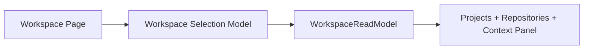

# FoxPilot 第二阶段 Workspace 页面选择模型

## 1. 文档目的

这份文档只定义一件事：

> 第二阶段 `Workspace` 页面里，项目与仓库应该如何选择、联动、跳转，避免既像两个页面又像一个混乱列表。

如果没有这层模型，后面很容易出现：

- `Projects` 和 `Repositories` 虽然被收进同一个导航，但交互上还是两套系统
- 选中项目后仓库列表不稳定
- 跳转 Tasks / Runs / Health 时上下文丢失

## 2. 定位

`Workspace` 页面不是：

- 普通文件树
- 纯仓库清单
- 单纯项目详情页

它是：

> 项目与仓库的统一工作区视图。

## 3. 第一原则

第二阶段 `Workspace` 必须固定：

```text
项目是上层容器
仓库是可操作对象
选择必须能稳定传递到任务、运行、健康和初始化流程
```

## 4. 总链



## 5. 正式选择结构

建议第二阶段统一为：

```ts
interface WorkspaceSelectionState {
  view: 'projects' | 'repositories'
  selectedProjectId?: string
  selectedRepositoryId?: string
  filterText?: string
  onlyDegraded?: boolean
  onlyUnmanaged?: boolean
}
```

## 6. 选择规则

### 6.1 项目选择

当用户选中一个项目时：

- 右侧面板展示项目摘要
- 仓库列表收敛到该项目下
- 与该项目相关的未接管、异常、待初始化状态需要被强调

### 6.2 仓库选择

当用户选中一个仓库时：

- 右侧面板展示仓库摘要
- 展示最近同步、doctor、hooks、任务数量
- 提供跳转到 Tasks / Runs / Health / Init Wizard 的入口

### 6.3 仓库不能脱离项目上下文

第二阶段应尽量避免：

```text
用户看到一个仓库，却不知道它属于哪个项目
```

所以仓库选择结果里必须稳定保留 `projectId`。

## 7. 两种视图

建议第二阶段固定两种视图：

```text
Projects View
Repositories View
```

### 7.1 Projects View

强调：

- 项目列表
- 项目状态
- 该项目下仓库概况
- 是否已接管

### 7.2 Repositories View

强调：

- 仓库健康状态
- 最近同步 / doctor
- 是否需要重新初始化
- 与任务 / 运行的关系

## 8. 右侧面板承接

`Workspace` 页右侧面板应根据当前选中对象切换为：

- `ProjectContextPanel`
- `RepositoryContextPanel`
- `EmptyContextPanel`

不要让 `Workspace` 再独立发明第三套详情结构。

## 9. 推荐动作边界

`Workspace` 页面第一批建议只放：

```text
查看项目 / 仓库详情
跳转 Tasks
跳转 Runs
跳转 Health
进入 Init Wizard
```

不建议一上来就在 `Workspace` 页做复杂写动作。

## 10. 与 Init Wizard 的关系

`Workspace` 页是 `Init Wizard` 的主要入口之一。

建议通过这些状态触发：

- 未接管项目
- 未初始化仓库
- doctor 判定需要 repair / re-init

但 `Workspace` 本身不替代 `Init Wizard`。

## 11. 第一批范围控制

第二阶段第一批先不做：

- 多选项目 / 仓库
- 拖拽仓库分组
- 用户自定义视图
- 跨项目批量修复

先固定：

```text
单选项目
单选仓库
两种稳定视图
稳定跳转关系
```

## 12. 审核点

你审核这份模型时，重点看：

```text
1  是否接受 Workspace 作为项目与仓库的统一视图
2  是否接受 Projects View / Repositories View 两种稳定视图
3  是否接受仓库选择必须保留项目上下文
4  是否接受 Workspace 第一批以查看、跳转、进入 Init Wizard 为主
```
